``` r
library(tidyverse)
library(scales)
library(knitr)
library(kableExtra)
library(coin)    
library(rstatix)    
library(patchwork)
library(servr)

# Paleta principal
col_rojo  <- "#C0392B"
col_azul  <- "#2C3E6B"
col_verde <- "#4A7C59"
nude_pal  <- c(col_rojo, col_azul)
```

---

## Introducción

Las enfermedades cardíacas representan la principal causa de muerte en Estados Unidos, cobrando aproximadamente 647.000 vidas cada año y generando una de las mayores cargas económicas y sanitarias del país. A diferencia de otras enfermedades, la cardiopatía coronaria avanza de forma silenciosa: la acumulación de placa en las arterias, la inflamación crónica, la hipertensión y la diabetes deterioran el sistema cardiovascular durante años antes de que aparezca cualquier síntoma visible.

La situación se agrava con una tendencia preocupante en la población joven. Un estudio reciente de la American Heart Association reportó que las muertes hospitalarias por infarto severo en adultos menores de 55 años aumentaron un 57% entre 2011 y 2022. Las mujeres jóvenes presentaron tasas de mortalidad más altas que los hombres del mismo grupo etario, frecuentemente asociadas a factores no tradicionales como los bajos ingresos.

El dataset empleado corresponde a la versión depurada del BRFSS 2015, con 253.680 registros y 21 variables que incluyen indicadores como el índice de masa corporal, actividad física, tabaquismo, consumo de alcohol, presión arterial, colesterol, diabetes, acceso a atención médica y características sociodemográficas.

---

## Objetivo general

Examinar, a través de técnicas de análisis exploratorio y visualización de datos, qué factores conductuales, clínicos y sociodemográficos presentan mayor asociación con el riesgo de enfermedad cardíaca en adultos estadounidenses, detectando patrones, contrastes entre grupos y variables con mayor capacidad explicativa como base para una futura modelación predictiva.

### Objetivos específicos

- Describir la distribución de las variables clínicas, conductuales y sociodemográficas presentes en el BRFSS 2015, identificando frecuencias, proporciones y posibles valores atípicos.
- Analizar el desbalance de clases en la variable objetivo (`HeartDiseaseorAttack`) y evaluar su implicación para el análisis y la futura modelación.
- Examinar la relación entre los factores de riesgo cardiovascular y la presencia de enfermedad cardíaca en la población encuestada.
- Comparar el perfil de salud y los hábitos de vida entre individuos con y sin enfermedad cardíaca, identificando contrastes estadísticamente relevantes entre ambos grupos.

---

## Marco Teórico

### Enfermedades cardíacas e insuficiencia cardíaca

La insuficiencia cardíaca es un trastorno en el que el corazón es incapaz de satisfacer las demandas del organismo, lo que genera una reducción del flujo sanguíneo y congestión en venas y pulmones. Puede originarse por causas directas —como el debilitamiento o rigidez del músculo cardíaco— o indirectas, producto de condiciones como la hipertensión arterial, la diabetes o valvulopatías.

### El sistema BRFSS como fuente de datos

El Sistema de Vigilancia de Factores de Riesgo Conductuales (BRFSS) es el principal sistema nacional de encuestas telefónicas sobre salud en Estados Unidos, administrado por los CDC desde 1984. Recopila datos en los 50 estados con más de 400.000 entrevistas a adultos cada año.

### Análisis exploratorio de datos (EDA)

El análisis exploratorio de datos (EDA) es un enfoque metodológico que permite examinar conjuntos de datos para resumir sus características principales, descubrir patrones, detectar anomalías y evaluar supuestos antes de aplicar técnicas de modelado formal. Desarrollado por John Tukey en la década de 1970, emplea principalmente métodos de visualización estadística para revelar relaciones entre variables.

---

## Metodologías de los análisis

**Metodología del análisis univariado:** El análisis univariado se realiza según la naturaleza estadística de cada variable. Para variables binarias se calculan frecuencias absolutas y relativas visualizadas en barras verticales. Para variables ordinales se usan barras horizontales preservando el orden natural. Para variables continuas se construye una tabla descriptiva completa (media, mediana, desviación estándar, cuartiles, IQR, outliers) y se representan con histograma (BMI) o barras por valor exacto (MentHlth, PhysHlth).

**Metodología del análisis bivariado:** Se emplean tres estrategias según el tipo estadístico: Chi-cuadrado + V de Cramér para variables binarias y ordinales; Mann-Whitney U para variables continuas dada su distribución asimétrica; y tasas de incidencia por grupo para interpretación clínica directa.

---

## Carga y estructura del dataset


``` r
df <- read_csv("heart_disease_health_indicators_BRFSS2015.csv")

cat("Dimensiones:", nrow(df), "filas x", ncol(df), "columnas\n")
```

```
## Dimensiones: 253680 filas x 22 columnas
```

``` r
glimpse(df)
```

```
## Rows: 253,680
## Columns: 22
## $ HeartDiseaseorAttack <dbl> 0, 0, 0, 0, 0, 0, 0, 0, 1, 0, 0, 0, 0, 0, 0, 0, 0…
## $ HighBP               <dbl> 1, 0, 1, 1, 1, 1, 1, 1, 1, 0, 0, 1, 0, 1, 0, 1, 1…
## $ HighChol             <dbl> 1, 0, 1, 0, 1, 1, 0, 1, 1, 0, 0, 1, 0, 1, 1, 0, 1…
## $ CholCheck            <dbl> 1, 0, 1, 1, 1, 1, 1, 1, 1, 1, 1, 1, 1, 1, 1, 1, 1…
## $ BMI                  <dbl> 40, 25, 28, 27, 24, 25, 30, 25, 30, 24, 25, 34, 2…
## $ Smoker               <dbl> 1, 1, 0, 0, 0, 1, 1, 1, 1, 0, 1, 1, 1, 0, 1, 0, 0…
## $ Stroke               <dbl> 0, 0, 0, 0, 0, 0, 0, 0, 0, 0, 0, 0, 0, 0, 1, 0, 0…
## $ Diabetes             <dbl> 0, 0, 0, 0, 0, 0, 0, 0, 2, 0, 2, 0, 0, 2, 0, 0, 0…
## $ PhysActivity         <dbl> 0, 1, 0, 1, 1, 1, 0, 1, 0, 0, 1, 0, 0, 0, 1, 1, 1…
## $ Fruits               <dbl> 0, 0, 1, 1, 1, 1, 0, 0, 1, 0, 1, 1, 0, 0, 0, 0, 1…
## $ Veggies              <dbl> 1, 0, 0, 1, 1, 1, 0, 1, 1, 1, 1, 1, 1, 1, 1, 0, 1…
## $ HvyAlcoholConsump    <dbl> 0, 0, 0, 0, 0, 0, 0, 0, 0, 0, 0, 0, 0, 0, 0, 0, 0…
## $ AnyHealthcare        <dbl> 1, 0, 1, 1, 1, 1, 1, 1, 1, 1, 1, 1, 1, 1, 1, 1, 1…
## $ NoDocbcCost          <dbl> 0, 1, 1, 0, 0, 0, 0, 0, 0, 0, 0, 0, 0, 0, 1, 0, 0…
## $ GenHlth              <dbl> 5, 3, 5, 2, 2, 2, 3, 3, 5, 2, 3, 3, 3, 4, 4, 2, 3…
## $ MentHlth             <dbl> 18, 0, 30, 0, 3, 0, 0, 0, 30, 0, 0, 0, 0, 0, 30, …
## $ PhysHlth             <dbl> 15, 0, 30, 0, 0, 2, 14, 0, 30, 0, 0, 30, 15, 0, 2…
## $ DiffWalk             <dbl> 1, 0, 1, 0, 0, 0, 0, 1, 1, 0, 0, 1, 0, 1, 0, 0, 0…
## $ Sex                  <dbl> 0, 0, 0, 0, 0, 1, 0, 0, 0, 1, 1, 0, 0, 0, 0, 0, 0…
## $ Age                  <dbl> 9, 7, 9, 11, 11, 10, 9, 11, 9, 8, 13, 10, 7, 11, …
## $ Education            <dbl> 4, 6, 4, 3, 5, 6, 6, 4, 5, 4, 6, 5, 5, 4, 6, 6, 4…
## $ Income               <dbl> 3, 1, 8, 6, 4, 8, 7, 4, 1, 3, 8, 1, 7, 6, 2, 8, 3…
```

El dataset contiene 253.680 registros y 22 variables. De las 22 variables, 1 corresponde a la variable objetivo (`HeartDiseaseorAttack`) y las 21 restantes representan factores de riesgo distribuidos entre variables binarias, ordinales y continuas.

### Estructura


``` r
df %>%
  summarise(across(everything(), ~class(.x))) %>%
  pivot_longer(everything(), names_to = "Variable", values_to = "Tipo") %>%
  kable(caption = "Tipo de dato por variable") %>%
  kable_styling(bootstrap_options = c("striped", "hover"), full_width = FALSE)
```

<table class="table table-striped table-hover" style="color: black; width: auto !important; margin-left: auto; margin-right: auto;">
<caption>(\#tab:estructura)(\#tab:estructura)Tipo de dato por variable</caption>
 <thead>
  <tr>
   <th style="text-align:left;"> Variable </th>
   <th style="text-align:left;"> Tipo </th>
  </tr>
 </thead>
<tbody>
  <tr>
   <td style="text-align:left;"> HeartDiseaseorAttack </td>
   <td style="text-align:left;"> numeric </td>
  </tr>
  <tr>
   <td style="text-align:left;"> HighBP </td>
   <td style="text-align:left;"> numeric </td>
  </tr>
  <tr>
   <td style="text-align:left;"> HighChol </td>
   <td style="text-align:left;"> numeric </td>
  </tr>
  <tr>
   <td style="text-align:left;"> CholCheck </td>
   <td style="text-align:left;"> numeric </td>
  </tr>
  <tr>
   <td style="text-align:left;"> BMI </td>
   <td style="text-align:left;"> numeric </td>
  </tr>
  <tr>
   <td style="text-align:left;"> Smoker </td>
   <td style="text-align:left;"> numeric </td>
  </tr>
  <tr>
   <td style="text-align:left;"> Stroke </td>
   <td style="text-align:left;"> numeric </td>
  </tr>
  <tr>
   <td style="text-align:left;"> Diabetes </td>
   <td style="text-align:left;"> numeric </td>
  </tr>
  <tr>
   <td style="text-align:left;"> PhysActivity </td>
   <td style="text-align:left;"> numeric </td>
  </tr>
  <tr>
   <td style="text-align:left;"> Fruits </td>
   <td style="text-align:left;"> numeric </td>
  </tr>
  <tr>
   <td style="text-align:left;"> Veggies </td>
   <td style="text-align:left;"> numeric </td>
  </tr>
  <tr>
   <td style="text-align:left;"> HvyAlcoholConsump </td>
   <td style="text-align:left;"> numeric </td>
  </tr>
  <tr>
   <td style="text-align:left;"> AnyHealthcare </td>
   <td style="text-align:left;"> numeric </td>
  </tr>
  <tr>
   <td style="text-align:left;"> NoDocbcCost </td>
   <td style="text-align:left;"> numeric </td>
  </tr>
  <tr>
   <td style="text-align:left;"> GenHlth </td>
   <td style="text-align:left;"> numeric </td>
  </tr>
  <tr>
   <td style="text-align:left;"> MentHlth </td>
   <td style="text-align:left;"> numeric </td>
  </tr>
  <tr>
   <td style="text-align:left;"> PhysHlth </td>
   <td style="text-align:left;"> numeric </td>
  </tr>
  <tr>
   <td style="text-align:left;"> DiffWalk </td>
   <td style="text-align:left;"> numeric </td>
  </tr>
  <tr>
   <td style="text-align:left;"> Sex </td>
   <td style="text-align:left;"> numeric </td>
  </tr>
  <tr>
   <td style="text-align:left;"> Age </td>
   <td style="text-align:left;"> numeric </td>
  </tr>
  <tr>
   <td style="text-align:left;"> Education </td>
   <td style="text-align:left;"> numeric </td>
  </tr>
  <tr>
   <td style="text-align:left;"> Income </td>
   <td style="text-align:left;"> numeric </td>
  </tr>
</tbody>
</table>

Aunque todas las variables se almacenan como numéricas (`dbl`), su naturaleza estadística varía: `Sex` es nominal binaria, `Age` es ordinal con 13 categorías, y `BMI` es genuinamente continua. Clasificarlas correctamente determina qué visualizaciones y estadísticas aplicar.

### Definir variables binarias, ordinales y continuas


``` r
target_var    <- "HeartDiseaseorAttack"

binary_vars <- c("HighBP","HighChol","CholCheck","Smoker","Stroke",
                 "PhysActivity","Fruits","Veggies","HvyAlcoholConsump",
                 "AnyHealthcare","NoDocbcCost","DiffWalk","Sex")

ordinal_vars <- c("GenHlth","Age","Education","Income","Diabetes")

continuous_vars <- c("BMI","MentHlth","PhysHlth")

cat("Variable objetivo :", target_var, "\n")
```

```
## Variable objetivo : HeartDiseaseorAttack
```

``` r
cat("Binarias          :", paste(binary_vars,  collapse=", "), "\n")
```

```
## Binarias          : HighBP, HighChol, CholCheck, Smoker, Stroke, PhysActivity, Fruits, Veggies, HvyAlcoholConsump, AnyHealthcare, NoDocbcCost, DiffWalk, Sex
```

``` r
cat("Ordinales         :", paste(ordinal_vars,  collapse=", "), "\n")
```

```
## Ordinales         : GenHlth, Age, Education, Income, Diabetes
```

``` r
cat("Continuas         :", paste(continuous_vars, collapse=", "), "\n")
```

```
## Continuas         : BMI, MentHlth, PhysHlth
```

``` r
cat("Total clasificadas:", 1 + length(binary_vars) + length(ordinal_vars) + length(continuous_vars), "\n")
```

```
## Total clasificadas: 22
```

### Conversión de etiquetas


``` r
df_1 <- df %>%
  mutate(
    HeartDiseaseorAttack = factor(HeartDiseaseorAttack,
      levels=c(0,1), labels=c("Sin enfermedad cardíaca","Con enfermedad cardíaca")),
    HighBP           = factor(HighBP,    levels=c(0,1), labels=c("Sin hipertensión","Con hipertensión")),
    HighChol         = factor(HighChol,  levels=c(0,1), labels=c("Sin colesterol alto","Con colesterol alto")),
    CholCheck        = factor(CholCheck, levels=c(0,1), labels=c("Sin chequeo en 5 años","Con chequeo en 5 años")),
    Smoker           = factor(Smoker,    levels=c(0,1), labels=c("No fumador","Fumador")),
    Stroke           = factor(Stroke,    levels=c(0,1), labels=c("Sin ACV","Con ACV")),
    PhysActivity     = factor(PhysActivity, levels=c(0,1), labels=c("Sin actividad física","Con actividad física")),
    Fruits           = factor(Fruits,    levels=c(0,1), labels=c("No consume frutas","Consume frutas diario")),
    Veggies          = factor(Veggies,   levels=c(0,1), labels=c("No consume verduras","Consume verduras diario")),
    HvyAlcoholConsump= factor(HvyAlcoholConsump, levels=c(0,1), labels=c("No consumo alto","Consumo alto alcohol")),
    AnyHealthcare    = factor(AnyHealthcare, levels=c(0,1), labels=c("Sin cobertura médica","Con cobertura médica")),
    NoDocbcCost      = factor(NoDocbcCost, levels=c(0,1), labels=c("Sin barrera económica","Con barrera económica")),
    DiffWalk         = factor(DiffWalk,  levels=c(0,1), labels=c("Sin dificultad al caminar","Con dificultad al caminar")),
    Sex              = factor(Sex,       levels=c(0,1), labels=c("Mujer","Hombre")),
    Diabetes         = factor(Diabetes,  levels=c(0,1,2),
                              labels=c("Sin diabetes","Prediabetes","Diabetes confirmada"), ordered=TRUE),
    GenHlth          = factor(GenHlth,   levels=1:5,
                              labels=c("Excelente","Muy buena","Buena","Regular","Mala"), ordered=TRUE),
    Age              = factor(Age, levels=1:13,
                              labels=c("18–24","25–29","30–34","35–39","40–44","45–49",
                                       "50–54","55–59","60–64","65–69","70–74","75–79","80+"), ordered=TRUE),
    Education        = factor(Education, levels=1:6,
                              labels=c("Nunca asistió","Primaria incompleta","Secundaria incompleta",
                                       "Secundaria completa","Universidad incompleta","Universidad completa"), ordered=TRUE),
    Income           = factor(Income, levels=1:8,
                              labels=c("< $10,000","$10,000–15,000","$15,000–20,000","$20,000–25,000",
                                       "$25,000–35,000","$35,000–50,000","$50,000–75,000","$75,000+"), ordered=TRUE)
  )

cat("Conversión completada.\n")
```

```
## Conversión completada.
```

### Diccionario de datos


``` r
dict <- tibble(
  Variable    = c("HeartDiseaseorAttack","HighBP","HighChol","CholCheck","BMI","Smoker",
                  "Stroke","Diabetes","PhysActivity","Fruits","Veggies","HvyAlcoholConsump",
                  "AnyHealthcare","NoDocbcCost","GenHlth","MentHlth","PhysHlth",
                  "DiffWalk","Sex","Age","Education","Income"),
  Tipo        = c("Binaria (objetivo)","Binaria","Binaria","Binaria","Continua","Binaria",
                  "Binaria","Ordinal (3 niveles)","Binaria","Binaria","Binaria","Binaria",
                  "Binaria","Binaria","Ordinal","Continua","Continua",
                  "Binaria","Binaria","Ordinal","Ordinal","Ordinal"),
  Escala      = c("0/1","0/1","0/1","0/1","12–98","0/1",
                  "0/1","0/1/2","0/1","0/1","0/1","0/1",
                  "0/1","0/1","1–5","0–30 días","0–30 días",
                  "0/1","0/1","1–13","1–6","1–8"),
  Descripcion = c("Reportó enfermedad coronaria o infarto","Diagnóstico de presión arterial alta",
                  "Diagnóstico de colesterol alto","Revisión de colesterol en últimos 5 años",
                  "Índice de masa corporal","Fumó al menos 100 cigarrillos en su vida",
                  "Diagnóstico de derrame cerebral (ACV)","0=Sin diabetes · 1=Prediabetes · 2=Diabetes",
                  "Realizó actividad física en últimos 30 días","Consume frutas 1+ veces al día",
                  "Consume verduras 1+ veces al día","Consumo excesivo de alcohol",
                  "Tiene cobertura o seguro médico","No fue al médico en el último año por costo",
                  "Autopercepción de salud general (1=Excelente · 5=Mala)",
                  "Días con mala salud mental en el último mes",
                  "Días con mala salud física en el último mes",
                  "Dificultad seria para caminar o subir escaleras","0=Mujer · 1=Hombre",
                  "Grupo etario en intervalos de 5 años","Nivel educativo (1=Sin escolaridad · 6=Universitario)",
                  "Ingreso anual del hogar (1=<$10k · 8=≥$75k)")
)

dict %>%
  kable(caption = "Diccionario de variables") %>%
  kable_styling(bootstrap_options = c("striped","hover"), full_width = TRUE, font_size = 12)
```

<table class="table table-striped table-hover" style="font-size: 12px; color: black; margin-left: auto; margin-right: auto;">
<caption style="font-size: initial !important;">(\#tab:diccionario)(\#tab:diccionario)Diccionario de variables</caption>
 <thead>
  <tr>
   <th style="text-align:left;"> Variable </th>
   <th style="text-align:left;"> Tipo </th>
   <th style="text-align:left;"> Escala </th>
   <th style="text-align:left;"> Descripcion </th>
  </tr>
 </thead>
<tbody>
  <tr>
   <td style="text-align:left;"> HeartDiseaseorAttack </td>
   <td style="text-align:left;"> Binaria (objetivo) </td>
   <td style="text-align:left;"> 0/1 </td>
   <td style="text-align:left;"> Reportó enfermedad coronaria o infarto </td>
  </tr>
  <tr>
   <td style="text-align:left;"> HighBP </td>
   <td style="text-align:left;"> Binaria </td>
   <td style="text-align:left;"> 0/1 </td>
   <td style="text-align:left;"> Diagnóstico de presión arterial alta </td>
  </tr>
  <tr>
   <td style="text-align:left;"> HighChol </td>
   <td style="text-align:left;"> Binaria </td>
   <td style="text-align:left;"> 0/1 </td>
   <td style="text-align:left;"> Diagnóstico de colesterol alto </td>
  </tr>
  <tr>
   <td style="text-align:left;"> CholCheck </td>
   <td style="text-align:left;"> Binaria </td>
   <td style="text-align:left;"> 0/1 </td>
   <td style="text-align:left;"> Revisión de colesterol en últimos 5 años </td>
  </tr>
  <tr>
   <td style="text-align:left;"> BMI </td>
   <td style="text-align:left;"> Continua </td>
   <td style="text-align:left;"> 12–98 </td>
   <td style="text-align:left;"> Índice de masa corporal </td>
  </tr>
  <tr>
   <td style="text-align:left;"> Smoker </td>
   <td style="text-align:left;"> Binaria </td>
   <td style="text-align:left;"> 0/1 </td>
   <td style="text-align:left;"> Fumó al menos 100 cigarrillos en su vida </td>
  </tr>
  <tr>
   <td style="text-align:left;"> Stroke </td>
   <td style="text-align:left;"> Binaria </td>
   <td style="text-align:left;"> 0/1 </td>
   <td style="text-align:left;"> Diagnóstico de derrame cerebral (ACV) </td>
  </tr>
  <tr>
   <td style="text-align:left;"> Diabetes </td>
   <td style="text-align:left;"> Ordinal (3 niveles) </td>
   <td style="text-align:left;"> 0/1/2 </td>
   <td style="text-align:left;"> 0=Sin diabetes · 1=Prediabetes · 2=Diabetes </td>
  </tr>
  <tr>
   <td style="text-align:left;"> PhysActivity </td>
   <td style="text-align:left;"> Binaria </td>
   <td style="text-align:left;"> 0/1 </td>
   <td style="text-align:left;"> Realizó actividad física en últimos 30 días </td>
  </tr>
  <tr>
   <td style="text-align:left;"> Fruits </td>
   <td style="text-align:left;"> Binaria </td>
   <td style="text-align:left;"> 0/1 </td>
   <td style="text-align:left;"> Consume frutas 1+ veces al día </td>
  </tr>
  <tr>
   <td style="text-align:left;"> Veggies </td>
   <td style="text-align:left;"> Binaria </td>
   <td style="text-align:left;"> 0/1 </td>
   <td style="text-align:left;"> Consume verduras 1+ veces al día </td>
  </tr>
  <tr>
   <td style="text-align:left;"> HvyAlcoholConsump </td>
   <td style="text-align:left;"> Binaria </td>
   <td style="text-align:left;"> 0/1 </td>
   <td style="text-align:left;"> Consumo excesivo de alcohol </td>
  </tr>
  <tr>
   <td style="text-align:left;"> AnyHealthcare </td>
   <td style="text-align:left;"> Binaria </td>
   <td style="text-align:left;"> 0/1 </td>
   <td style="text-align:left;"> Tiene cobertura o seguro médico </td>
  </tr>
  <tr>
   <td style="text-align:left;"> NoDocbcCost </td>
   <td style="text-align:left;"> Binaria </td>
   <td style="text-align:left;"> 0/1 </td>
   <td style="text-align:left;"> No fue al médico en el último año por costo </td>
  </tr>
  <tr>
   <td style="text-align:left;"> GenHlth </td>
   <td style="text-align:left;"> Ordinal </td>
   <td style="text-align:left;"> 1–5 </td>
   <td style="text-align:left;"> Autopercepción de salud general (1=Excelente · 5=Mala) </td>
  </tr>
  <tr>
   <td style="text-align:left;"> MentHlth </td>
   <td style="text-align:left;"> Continua </td>
   <td style="text-align:left;"> 0–30 días </td>
   <td style="text-align:left;"> Días con mala salud mental en el último mes </td>
  </tr>
  <tr>
   <td style="text-align:left;"> PhysHlth </td>
   <td style="text-align:left;"> Continua </td>
   <td style="text-align:left;"> 0–30 días </td>
   <td style="text-align:left;"> Días con mala salud física en el último mes </td>
  </tr>
  <tr>
   <td style="text-align:left;"> DiffWalk </td>
   <td style="text-align:left;"> Binaria </td>
   <td style="text-align:left;"> 0/1 </td>
   <td style="text-align:left;"> Dificultad seria para caminar o subir escaleras </td>
  </tr>
  <tr>
   <td style="text-align:left;"> Sex </td>
   <td style="text-align:left;"> Binaria </td>
   <td style="text-align:left;"> 0/1 </td>
   <td style="text-align:left;"> 0=Mujer · 1=Hombre </td>
  </tr>
  <tr>
   <td style="text-align:left;"> Age </td>
   <td style="text-align:left;"> Ordinal </td>
   <td style="text-align:left;"> 1–13 </td>
   <td style="text-align:left;"> Grupo etario en intervalos de 5 años </td>
  </tr>
  <tr>
   <td style="text-align:left;"> Education </td>
   <td style="text-align:left;"> Ordinal </td>
   <td style="text-align:left;"> 1–6 </td>
   <td style="text-align:left;"> Nivel educativo (1=Sin escolaridad · 6=Universitario) </td>
  </tr>
  <tr>
   <td style="text-align:left;"> Income </td>
   <td style="text-align:left;"> Ordinal </td>
   <td style="text-align:left;"> 1–8 </td>
   <td style="text-align:left;"> Ingreso anual del hogar (1=&lt;$10k · 8=≥$75k) </td>
  </tr>
</tbody>
</table>

---

## Limpieza

Antes de iniciar el análisis exploratorio se verifica la integridad del dataset: ausencia de valores faltantes, duplicados y valores fuera del rango esperado.

### Valores nulos


``` r
nulos <- df %>% summarise(across(everything(), ~sum(is.na(.)))) %>%
  pivot_longer(everything(), names_to="Variable", values_to="Nulos")

cat("Total de valores nulos:", sum(nulos$Nulos), "\n")
```

```
## Total de valores nulos: 0
```

``` r
nulos %>% filter(Nulos > 0) %>%
  kable(caption="Variables con valores nulos") %>%
  kable_styling(bootstrap_options="striped", full_width=FALSE)
```

<table class="table table-striped" style="color: black; width: auto !important; margin-left: auto; margin-right: auto;">
<caption>(\#tab:nulos)(\#tab:nulos)Variables con valores nulos</caption>
 <thead>
  <tr>
   <th style="text-align:left;"> Variable </th>
   <th style="text-align:right;"> Nulos </th>
  </tr>
 </thead>
<tbody>
  <tr>
   <td style="text-align:left;"> NA </td>
   <td style="text-align:right;"> NA </td>
  </tr>
  <tr>
   <td style="text-align:left;"> :-------- </td>
   <td style="text-align:right;"> -----: </td>
  </tr>
</tbody>
</table>

### Duplicados


``` r
total      <- nrow(df)
duplicados <- sum(duplicated(df))
pct_dup    <- round(duplicados / total * 100, 2)

tibble(
  `Total de registros`   = format(total,      big.mark="."),
  `Registros duplicados` = format(duplicados, big.mark="."),
  `Porcentaje`           = paste0(pct_dup, "%")
) %>%
  kable(caption="Registros duplicados") %>%
  kable_styling(bootstrap_options="striped", full_width=FALSE)
```

<table class="table table-striped" style="color: black; width: auto !important; margin-left: auto; margin-right: auto;">
<caption>(\#tab:duplicados)(\#tab:duplicados)Registros duplicados</caption>
 <thead>
  <tr>
   <th style="text-align:left;"> Total de registros </th>
   <th style="text-align:left;"> Registros duplicados </th>
   <th style="text-align:left;"> Porcentaje </th>
  </tr>
 </thead>
<tbody>
  <tr>
   <td style="text-align:left;"> 253.680 </td>
   <td style="text-align:left;"> 23.899 </td>
   <td style="text-align:left;"> 9.42% </td>
  </tr>
</tbody>
</table>

Tras la verificación se confirmó la ausencia total de valores nulos. Los 23.899 registros duplicados se conservan porque al tratarse de una encuesta poblacional con mayoría de variables binarias, es estadísticamente esperable que múltiples individuos compartan exactamente el mismo perfil de respuestas sin que esto represente un error de captura.

### Verificación de rangos esperados


``` r
rangos <- list(
  HeartDiseaseorAttack=c(0,1), HighBP=c(0,1), HighChol=c(0,1),
  CholCheck=c(0,1), BMI=c(12,98), Smoker=c(0,1), Stroke=c(0,1),
  Diabetes=c(0,2), PhysActivity=c(0,1), Fruits=c(0,1), Veggies=c(0,1),
  HvyAlcoholConsump=c(0,1), AnyHealthcare=c(0,1), NoDocbcCost=c(0,1),
  GenHlth=c(1,5), MentHlth=c(0,30), PhysHlth=c(0,30),
  DiffWalk=c(0,1), Sex=c(0,1), Age=c(1,13), Education=c(1,6), Income=c(1,8)
)

verificacion <- map_dfr(names(rangos), function(v) {
  tibble(
    Variable        = v,
    `Min esperado`  = rangos[[v]][1],
    `Max esperado`  = rangos[[v]][2],
    `Min real`      = min(df[[v]], na.rm=TRUE),
    `Max real`      = max(df[[v]], na.rm=TRUE),
    OK              = min(df[[v]], na.rm=TRUE) >= rangos[[v]][1] &
                      max(df[[v]], na.rm=TRUE) <= rangos[[v]][2]
  )
})

verificacion %>%
  kable(caption="Verificación de rangos por variable") %>%
  kable_styling(bootstrap_options=c("striped","hover"), full_width=FALSE) %>%
  column_spec(6, color=ifelse(verificacion$OK, "green", "red"))
```

<table class="table table-striped table-hover" style="color: black; width: auto !important; margin-left: auto; margin-right: auto;">
<caption>(\#tab:rangos)(\#tab:rangos)Verificación de rangos por variable</caption>
 <thead>
  <tr>
   <th style="text-align:left;"> Variable </th>
   <th style="text-align:right;"> Min esperado </th>
   <th style="text-align:right;"> Max esperado </th>
   <th style="text-align:right;"> Min real </th>
   <th style="text-align:right;"> Max real </th>
   <th style="text-align:left;"> OK </th>
  </tr>
 </thead>
<tbody>
  <tr>
   <td style="text-align:left;"> HeartDiseaseorAttack </td>
   <td style="text-align:right;"> 0 </td>
   <td style="text-align:right;"> 1 </td>
   <td style="text-align:right;"> 0 </td>
   <td style="text-align:right;"> 1 </td>
   <td style="text-align:left;color: green !important;"> TRUE </td>
  </tr>
  <tr>
   <td style="text-align:left;"> HighBP </td>
   <td style="text-align:right;"> 0 </td>
   <td style="text-align:right;"> 1 </td>
   <td style="text-align:right;"> 0 </td>
   <td style="text-align:right;"> 1 </td>
   <td style="text-align:left;color: green !important;"> TRUE </td>
  </tr>
  <tr>
   <td style="text-align:left;"> HighChol </td>
   <td style="text-align:right;"> 0 </td>
   <td style="text-align:right;"> 1 </td>
   <td style="text-align:right;"> 0 </td>
   <td style="text-align:right;"> 1 </td>
   <td style="text-align:left;color: green !important;"> TRUE </td>
  </tr>
  <tr>
   <td style="text-align:left;"> CholCheck </td>
   <td style="text-align:right;"> 0 </td>
   <td style="text-align:right;"> 1 </td>
   <td style="text-align:right;"> 0 </td>
   <td style="text-align:right;"> 1 </td>
   <td style="text-align:left;color: green !important;"> TRUE </td>
  </tr>
  <tr>
   <td style="text-align:left;"> BMI </td>
   <td style="text-align:right;"> 12 </td>
   <td style="text-align:right;"> 98 </td>
   <td style="text-align:right;"> 12 </td>
   <td style="text-align:right;"> 98 </td>
   <td style="text-align:left;color: green !important;"> TRUE </td>
  </tr>
  <tr>
   <td style="text-align:left;"> Smoker </td>
   <td style="text-align:right;"> 0 </td>
   <td style="text-align:right;"> 1 </td>
   <td style="text-align:right;"> 0 </td>
   <td style="text-align:right;"> 1 </td>
   <td style="text-align:left;color: green !important;"> TRUE </td>
  </tr>
  <tr>
   <td style="text-align:left;"> Stroke </td>
   <td style="text-align:right;"> 0 </td>
   <td style="text-align:right;"> 1 </td>
   <td style="text-align:right;"> 0 </td>
   <td style="text-align:right;"> 1 </td>
   <td style="text-align:left;color: green !important;"> TRUE </td>
  </tr>
  <tr>
   <td style="text-align:left;"> Diabetes </td>
   <td style="text-align:right;"> 0 </td>
   <td style="text-align:right;"> 2 </td>
   <td style="text-align:right;"> 0 </td>
   <td style="text-align:right;"> 2 </td>
   <td style="text-align:left;color: green !important;"> TRUE </td>
  </tr>
  <tr>
   <td style="text-align:left;"> PhysActivity </td>
   <td style="text-align:right;"> 0 </td>
   <td style="text-align:right;"> 1 </td>
   <td style="text-align:right;"> 0 </td>
   <td style="text-align:right;"> 1 </td>
   <td style="text-align:left;color: green !important;"> TRUE </td>
  </tr>
  <tr>
   <td style="text-align:left;"> Fruits </td>
   <td style="text-align:right;"> 0 </td>
   <td style="text-align:right;"> 1 </td>
   <td style="text-align:right;"> 0 </td>
   <td style="text-align:right;"> 1 </td>
   <td style="text-align:left;color: green !important;"> TRUE </td>
  </tr>
  <tr>
   <td style="text-align:left;"> Veggies </td>
   <td style="text-align:right;"> 0 </td>
   <td style="text-align:right;"> 1 </td>
   <td style="text-align:right;"> 0 </td>
   <td style="text-align:right;"> 1 </td>
   <td style="text-align:left;color: green !important;"> TRUE </td>
  </tr>
  <tr>
   <td style="text-align:left;"> HvyAlcoholConsump </td>
   <td style="text-align:right;"> 0 </td>
   <td style="text-align:right;"> 1 </td>
   <td style="text-align:right;"> 0 </td>
   <td style="text-align:right;"> 1 </td>
   <td style="text-align:left;color: green !important;"> TRUE </td>
  </tr>
  <tr>
   <td style="text-align:left;"> AnyHealthcare </td>
   <td style="text-align:right;"> 0 </td>
   <td style="text-align:right;"> 1 </td>
   <td style="text-align:right;"> 0 </td>
   <td style="text-align:right;"> 1 </td>
   <td style="text-align:left;color: green !important;"> TRUE </td>
  </tr>
  <tr>
   <td style="text-align:left;"> NoDocbcCost </td>
   <td style="text-align:right;"> 0 </td>
   <td style="text-align:right;"> 1 </td>
   <td style="text-align:right;"> 0 </td>
   <td style="text-align:right;"> 1 </td>
   <td style="text-align:left;color: green !important;"> TRUE </td>
  </tr>
  <tr>
   <td style="text-align:left;"> GenHlth </td>
   <td style="text-align:right;"> 1 </td>
   <td style="text-align:right;"> 5 </td>
   <td style="text-align:right;"> 1 </td>
   <td style="text-align:right;"> 5 </td>
   <td style="text-align:left;color: green !important;"> TRUE </td>
  </tr>
  <tr>
   <td style="text-align:left;"> MentHlth </td>
   <td style="text-align:right;"> 0 </td>
   <td style="text-align:right;"> 30 </td>
   <td style="text-align:right;"> 0 </td>
   <td style="text-align:right;"> 30 </td>
   <td style="text-align:left;color: green !important;"> TRUE </td>
  </tr>
  <tr>
   <td style="text-align:left;"> PhysHlth </td>
   <td style="text-align:right;"> 0 </td>
   <td style="text-align:right;"> 30 </td>
   <td style="text-align:right;"> 0 </td>
   <td style="text-align:right;"> 30 </td>
   <td style="text-align:left;color: green !important;"> TRUE </td>
  </tr>
  <tr>
   <td style="text-align:left;"> DiffWalk </td>
   <td style="text-align:right;"> 0 </td>
   <td style="text-align:right;"> 1 </td>
   <td style="text-align:right;"> 0 </td>
   <td style="text-align:right;"> 1 </td>
   <td style="text-align:left;color: green !important;"> TRUE </td>
  </tr>
  <tr>
   <td style="text-align:left;"> Sex </td>
   <td style="text-align:right;"> 0 </td>
   <td style="text-align:right;"> 1 </td>
   <td style="text-align:right;"> 0 </td>
   <td style="text-align:right;"> 1 </td>
   <td style="text-align:left;color: green !important;"> TRUE </td>
  </tr>
  <tr>
   <td style="text-align:left;"> Age </td>
   <td style="text-align:right;"> 1 </td>
   <td style="text-align:right;"> 13 </td>
   <td style="text-align:right;"> 1 </td>
   <td style="text-align:right;"> 13 </td>
   <td style="text-align:left;color: green !important;"> TRUE </td>
  </tr>
  <tr>
   <td style="text-align:left;"> Education </td>
   <td style="text-align:right;"> 1 </td>
   <td style="text-align:right;"> 6 </td>
   <td style="text-align:right;"> 1 </td>
   <td style="text-align:right;"> 6 </td>
   <td style="text-align:left;color: green !important;"> TRUE </td>
  </tr>
  <tr>
   <td style="text-align:left;"> Income </td>
   <td style="text-align:right;"> 1 </td>
   <td style="text-align:right;"> 8 </td>
   <td style="text-align:right;"> 1 </td>
   <td style="text-align:right;"> 8 </td>
   <td style="text-align:left;color: green !important;"> TRUE </td>
  </tr>
</tbody>
</table>

Las 22 variables se encuentran dentro de los rangos esperados, sin excepción.

---

## Análisis Univariado

### Variable Objetivo

#### HeartDiseaseorAttack: Enfermedad cardíaca


``` r
conteos_obj <- df %>%
  count(HeartDiseaseorAttack) %>%
  mutate(
    Clase      = ifelse(HeartDiseaseorAttack==0, "Sin enfermedad cardíaca", "Con enfermedad cardíaca"),
    Porcentaje = round(n / sum(n) * 100, 2)
  )

ggplot(conteos_obj, aes(x=Clase, y=n, fill=Clase)) +
  geom_col(width=0.5, color="white") +
  geom_text(aes(label=paste0(Porcentaje, "%")), vjust=-0.5, size=4, color="#3a3a3a") +
  scale_fill_manual(values=nude_pal) +
  scale_y_continuous(labels=label_comma(), limits=c(0, max(conteos_obj$n)*1.15)) +
  labs(title="Distribución de la variable objetivo", x="", y="Número de registros") +
  theme_minimal() +
  theme(legend.position="none", plot.title=element_text(color="#3a3a3a", size=13))
```

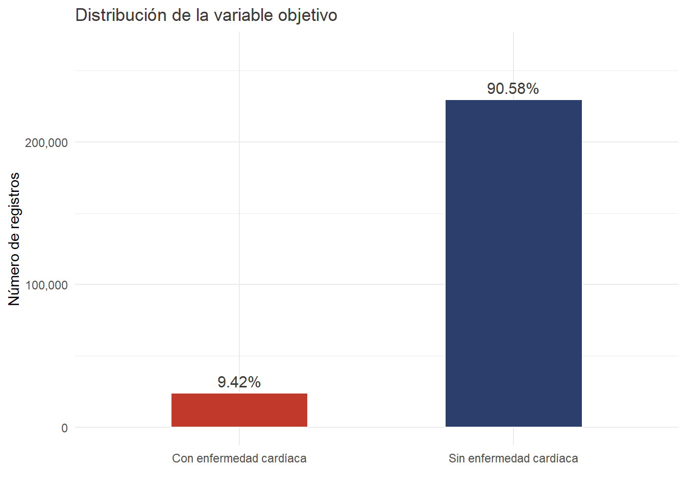

``` r
conteos_obj %>%
  select(Clase, Conteo=n, `Porcentaje (%)` = Porcentaje) %>%
  kable() %>% kable_styling(bootstrap_options="striped", full_width=FALSE)
```

<table class="table table-striped" style="color: black; width: auto !important; margin-left: auto; margin-right: auto;">
 <thead>
  <tr>
   <th style="text-align:left;"> Clase </th>
   <th style="text-align:right;"> Conteo </th>
   <th style="text-align:right;"> Porcentaje (%) </th>
  </tr>
 </thead>
<tbody>
  <tr>
   <td style="text-align:left;"> Sin enfermedad cardíaca </td>
   <td style="text-align:right;"> 229787 </td>
   <td style="text-align:right;"> 90.58 </td>
  </tr>
  <tr>
   <td style="text-align:left;"> Con enfermedad cardíaca </td>
   <td style="text-align:right;"> 23893 </td>
   <td style="text-align:right;"> 9.42 </td>
  </tr>
</tbody>
</table>

La variable objetivo presenta un marcado desbalance de clases: el 90.6% (229.787 personas) no reportó enfermedad cardíaca, frente a apenas el 9.42% (23.893 personas) que sí lo hizo. Este desbalance es crítico para la etapa de modelado; será necesario evaluar estrategias como métricas ajustadas (F1, AUC-ROC) y técnicas de balanceo como SMOTE o ajuste de pesos de clase.

### Variables Binarias


``` r
# Función auxiliar para graficar variables binarias
plot_binaria <- function(var, etiquetas, titulo) {
  conteos <- df %>%
    count(.data[[var]]) %>%
    mutate(
      Categoria  = etiquetas,
      Porcentaje = round(n / sum(n) * 100, 2)
    )

  p <- ggplot(conteos, aes(x=Categoria, y=n, fill=Categoria)) +
    geom_col(width=0.5, color="white") +
    geom_text(aes(label=paste0(Porcentaje, "%")), vjust=-0.5, size=4, color="#3a3a3a") +
    scale_fill_manual(values=nude_pal) +
    scale_y_continuous(labels=label_comma(), limits=c(0, max(conteos$n)*1.15)) +
    labs(title=titulo, x="", y="Número de registros") +
    theme_minimal() +
    theme(legend.position="none", plot.title=element_text(color="#3a3a3a", size=12))

  tbl <- conteos %>%
    select(Clase=Categoria, Conteo=n, `Porcentaje (%)`=Porcentaje)

  list(plot=p, tabla=tbl)
}
```

#### HighBP: Presión arterial alta


``` r
r <- plot_binaria("HighBP", c("Sin hipertensión","Con hipertensión"), "Distribución de HighBP")
print(r$plot)
```


``` r
r$tabla %>% kable() %>% kable_styling(bootstrap_options="striped", full_width=FALSE)
```

<table class="table table-striped" style="color: black; width: auto !important; margin-left: auto; margin-right: auto;">
 <thead>
  <tr>
   <th style="text-align:left;"> Clase </th>
   <th style="text-align:right;"> Conteo </th>
   <th style="text-align:right;"> Porcentaje (%) </th>
  </tr>
 </thead>
<tbody>
  <tr>
   <td style="text-align:left;"> Sin hipertensión </td>
   <td style="text-align:right;"> 144851 </td>
   <td style="text-align:right;"> 57.1 </td>
  </tr>
  <tr>
   <td style="text-align:left;"> Con hipertensión </td>
   <td style="text-align:right;"> 108829 </td>
   <td style="text-align:right;"> 42.9 </td>
  </tr>
</tbody>
</table>

El 57.1% (144.851 personas) no presenta hipertensión, mientras que el 42.9% (108.829 personas) sí ha recibido un diagnóstico de presión arterial alta. Casi la mitad de la muestra convive con hipertensión.

#### HighChol: Colesterol alto


``` r
r <- plot_binaria("HighChol", c("Sin colesterol alto","Con colesterol alto"), "Distribución de HighChol")
print(r$plot)
```

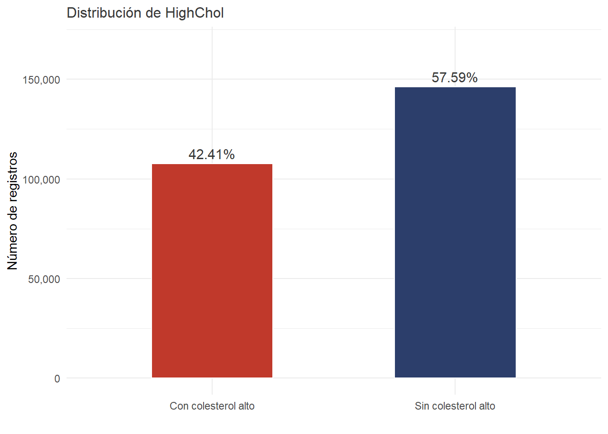

``` r
r$tabla %>% kable() %>% kable_styling(bootstrap_options="striped", full_width=FALSE)
```

<table class="table table-striped" style="color: black; width: auto !important; margin-left: auto; margin-right: auto;">
 <thead>
  <tr>
   <th style="text-align:left;"> Clase </th>
   <th style="text-align:right;"> Conteo </th>
   <th style="text-align:right;"> Porcentaje (%) </th>
  </tr>
 </thead>
<tbody>
  <tr>
   <td style="text-align:left;"> Sin colesterol alto </td>
   <td style="text-align:right;"> 146089 </td>
   <td style="text-align:right;"> 57.59 </td>
  </tr>
  <tr>
   <td style="text-align:left;"> Con colesterol alto </td>
   <td style="text-align:right;"> 107591 </td>
   <td style="text-align:right;"> 42.41 </td>
  </tr>
</tbody>
</table>

El 57.59% (146.089 personas) no presenta colesterol alto, mientras que el 42.41% (107.591 personas) sí. La distribución es similar a la de HighBP.

#### CholCheck: Chequeo del colesterol


``` r
r <- plot_binaria("CholCheck", c("Sin chequeo en 5 años","Con chequeo en 5 años"), "Distribución de CholCheck")
print(r$plot)
```

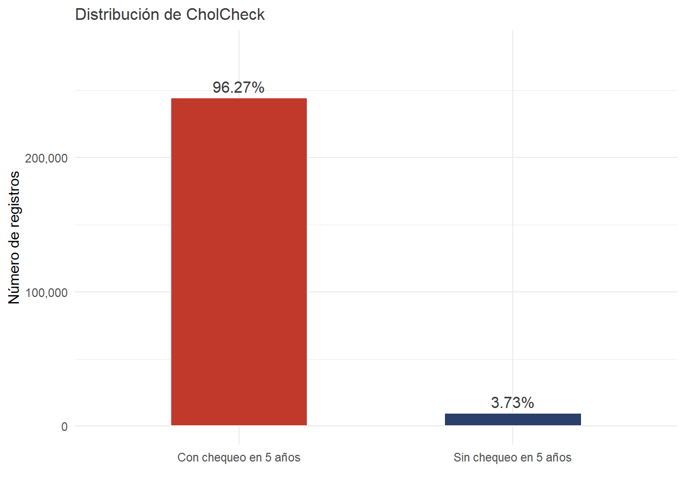

``` r
r$tabla %>% kable() %>% kable_styling(bootstrap_options="striped", full_width=FALSE)
```

<table class="table table-striped" style="color: black; width: auto !important; margin-left: auto; margin-right: auto;">
 <thead>
  <tr>
   <th style="text-align:left;"> Clase </th>
   <th style="text-align:right;"> Conteo </th>
   <th style="text-align:right;"> Porcentaje (%) </th>
  </tr>
 </thead>
<tbody>
  <tr>
   <td style="text-align:left;"> Sin chequeo en 5 años </td>
   <td style="text-align:right;"> 9470 </td>
   <td style="text-align:right;"> 3.73 </td>
  </tr>
  <tr>
   <td style="text-align:left;"> Con chequeo en 5 años </td>
   <td style="text-align:right;"> 244210 </td>
   <td style="text-align:right;"> 96.27 </td>
  </tr>
</tbody>
</table>

El 96.27% (244.210 personas) se realizó un chequeo de colesterol en los últimos 5 años. Distribución marcadamente asimétrica.

#### Smoker: Fumador


``` r
r <- plot_binaria("Smoker", c("No fumador","Fumador"), "Distribución de Smoker")
print(r$plot)
```

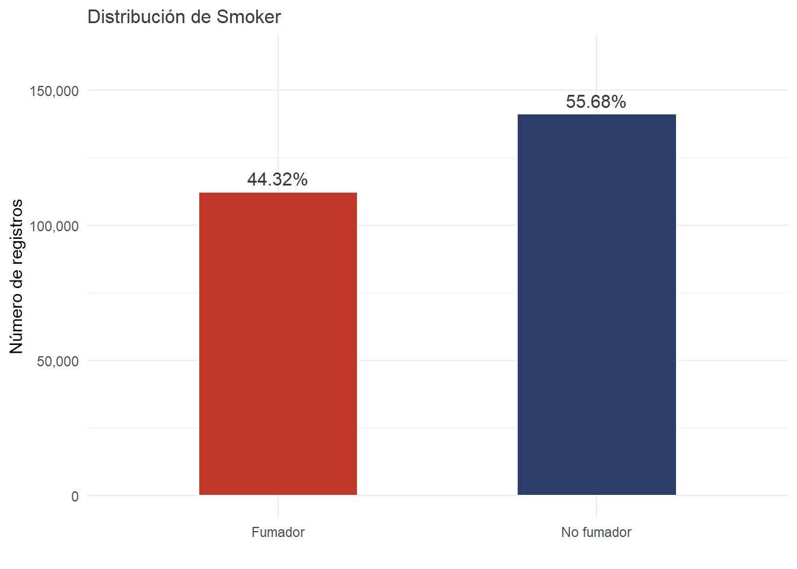

``` r
r$tabla %>% kable() %>% kable_styling(bootstrap_options="striped", full_width=FALSE)
```

<table class="table table-striped" style="color: black; width: auto !important; margin-left: auto; margin-right: auto;">
 <thead>
  <tr>
   <th style="text-align:left;"> Clase </th>
   <th style="text-align:right;"> Conteo </th>
   <th style="text-align:right;"> Porcentaje (%) </th>
  </tr>
 </thead>
<tbody>
  <tr>
   <td style="text-align:left;"> No fumador </td>
   <td style="text-align:right;"> 141257 </td>
   <td style="text-align:right;"> 55.68 </td>
  </tr>
  <tr>
   <td style="text-align:left;"> Fumador </td>
   <td style="text-align:right;"> 112423 </td>
   <td style="text-align:right;"> 44.32 </td>
  </tr>
</tbody>
</table>

El 55.68% (141.257 personas) nunca ha fumado, mientras que el 44.32% (112.423 personas) sí lo ha hecho.

#### Stroke: Derrame cerebral


``` r
r <- plot_binaria("Stroke", c("Sin ACV","Con ACV"), "Distribución de Stroke")
print(r$plot)
```

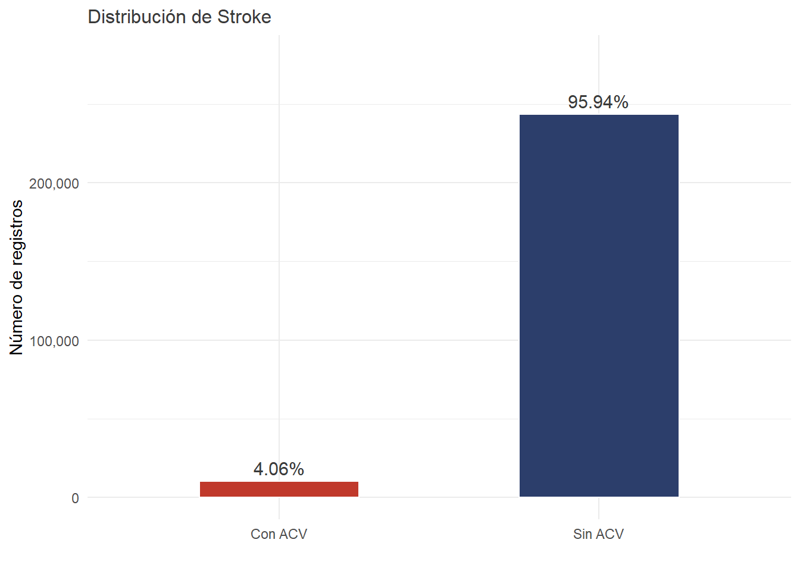

``` r
r$tabla %>% kable() %>% kable_styling(bootstrap_options="striped", full_width=FALSE)
```

<table class="table table-striped" style="color: black; width: auto !important; margin-left: auto; margin-right: auto;">
 <thead>
  <tr>
   <th style="text-align:left;"> Clase </th>
   <th style="text-align:right;"> Conteo </th>
   <th style="text-align:right;"> Porcentaje (%) </th>
  </tr>
 </thead>
<tbody>
  <tr>
   <td style="text-align:left;"> Sin ACV </td>
   <td style="text-align:right;"> 243388 </td>
   <td style="text-align:right;"> 95.94 </td>
  </tr>
  <tr>
   <td style="text-align:left;"> Con ACV </td>
   <td style="text-align:right;"> 10292 </td>
   <td style="text-align:right;"> 4.06 </td>
  </tr>
</tbody>
</table>

El 95.94% (243.388 personas) no ha sufrido un derrame cerebral; apenas el 4.06% (10.292 personas) sí lo ha reportado.

#### PhysActivity: Actividad física


``` r
r <- plot_binaria("PhysActivity", c("Sin actividad física","Con actividad física"), "Distribución de PhysActivity")
print(r$plot)
```

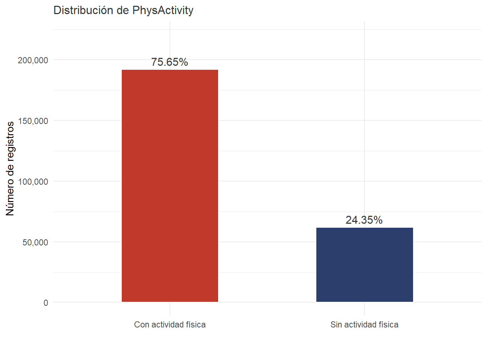

``` r
r$tabla %>% kable() %>% kable_styling(bootstrap_options="striped", full_width=FALSE)
```

<table class="table table-striped" style="color: black; width: auto !important; margin-left: auto; margin-right: auto;">
 <thead>
  <tr>
   <th style="text-align:left;"> Clase </th>
   <th style="text-align:right;"> Conteo </th>
   <th style="text-align:right;"> Porcentaje (%) </th>
  </tr>
 </thead>
<tbody>
  <tr>
   <td style="text-align:left;"> Sin actividad física </td>
   <td style="text-align:right;"> 61760 </td>
   <td style="text-align:right;"> 24.35 </td>
  </tr>
  <tr>
   <td style="text-align:left;"> Con actividad física </td>
   <td style="text-align:right;"> 191920 </td>
   <td style="text-align:right;"> 75.65 </td>
  </tr>
</tbody>
</table>

El 75.65% (191.920 personas) reportó actividad física en los últimos 30 días; el 24.35% (61.760 personas) no lo hizo.

#### Fruits: Consumo de Frutas


``` r
r <- plot_binaria("Fruits", c("No consume frutas","Consume frutas diario"), "Distribución de Fruits")
print(r$plot)
```

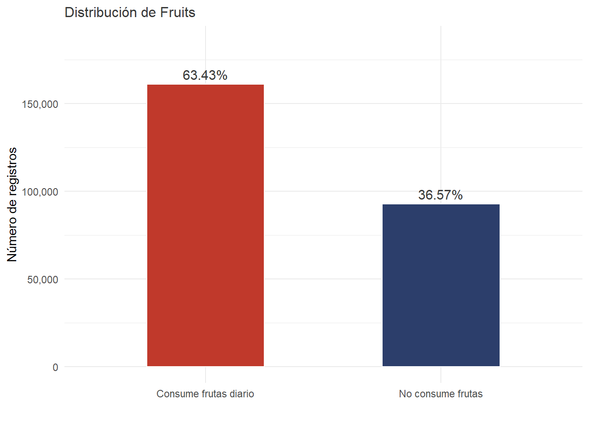

``` r
r$tabla %>% kable() %>% kable_styling(bootstrap_options="striped", full_width=FALSE)
```

<table class="table table-striped" style="color: black; width: auto !important; margin-left: auto; margin-right: auto;">
 <thead>
  <tr>
   <th style="text-align:left;"> Clase </th>
   <th style="text-align:right;"> Conteo </th>
   <th style="text-align:right;"> Porcentaje (%) </th>
  </tr>
 </thead>
<tbody>
  <tr>
   <td style="text-align:left;"> No consume frutas </td>
   <td style="text-align:right;"> 92782 </td>
   <td style="text-align:right;"> 36.57 </td>
  </tr>
  <tr>
   <td style="text-align:left;"> Consume frutas diario </td>
   <td style="text-align:right;"> 160898 </td>
   <td style="text-align:right;"> 63.43 </td>
  </tr>
</tbody>
</table>

El 63.43% (160.898 personas) consume frutas al menos una vez al día; el 36.57% (92.782 personas) no lo hace.

#### Veggies: Consumo de Vegetales


``` r
r <- plot_binaria("Veggies", c("No consume verduras","Consume verduras diario"), "Distribución de Veggies")
print(r$plot)
```

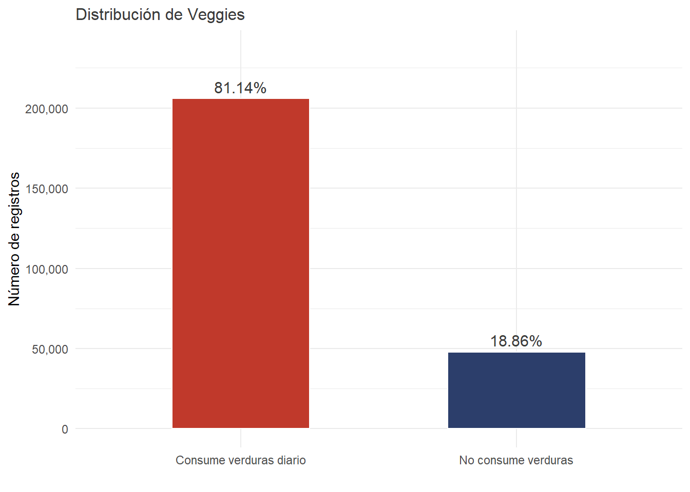

``` r
r$tabla %>% kable() %>% kable_styling(bootstrap_options="striped", full_width=FALSE)
```

<table class="table table-striped" style="color: black; width: auto !important; margin-left: auto; margin-right: auto;">
 <thead>
  <tr>
   <th style="text-align:left;"> Clase </th>
   <th style="text-align:right;"> Conteo </th>
   <th style="text-align:right;"> Porcentaje (%) </th>
  </tr>
 </thead>
<tbody>
  <tr>
   <td style="text-align:left;"> No consume verduras </td>
   <td style="text-align:right;"> 47839 </td>
   <td style="text-align:right;"> 18.86 </td>
  </tr>
  <tr>
   <td style="text-align:left;"> Consume verduras diario </td>
   <td style="text-align:right;"> 205841 </td>
   <td style="text-align:right;"> 81.14 </td>
  </tr>
</tbody>
</table>

El 81.14% (205.841 personas) consume verduras al menos una vez al día.

#### HvyAlcoholConsump: Consumo de alcohol


``` r
r <- plot_binaria("HvyAlcoholConsump", c("No consumo alto","Consumo alto alcohol"), "Distribución de HvyAlcoholConsump")
print(r$plot)
```

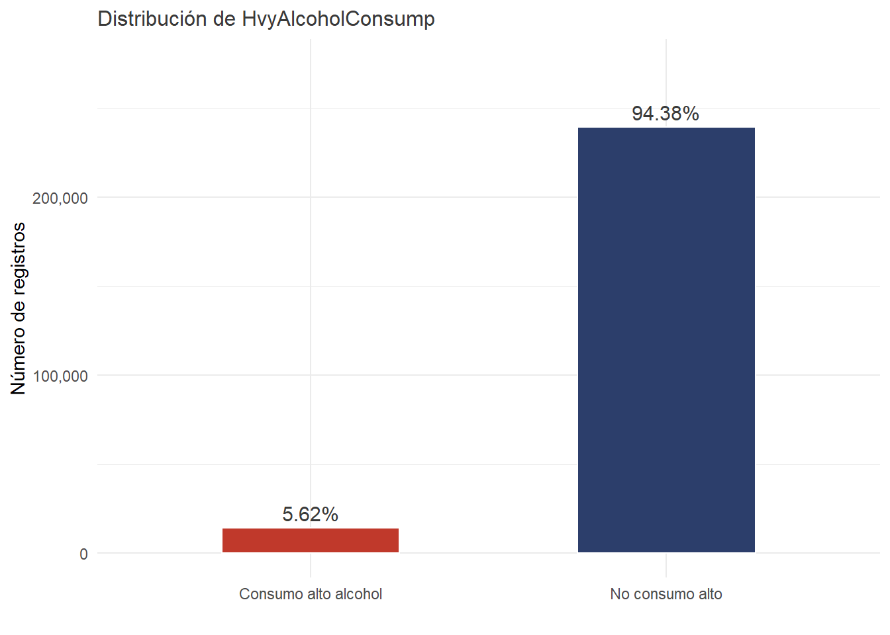

``` r
r$tabla %>% kable() %>% kable_styling(bootstrap_options="striped", full_width=FALSE)
```

<table class="table table-striped" style="color: black; width: auto !important; margin-left: auto; margin-right: auto;">
 <thead>
  <tr>
   <th style="text-align:left;"> Clase </th>
   <th style="text-align:right;"> Conteo </th>
   <th style="text-align:right;"> Porcentaje (%) </th>
  </tr>
 </thead>
<tbody>
  <tr>
   <td style="text-align:left;"> No consumo alto </td>
   <td style="text-align:right;"> 239424 </td>
   <td style="text-align:right;"> 94.38 </td>
  </tr>
  <tr>
   <td style="text-align:left;"> Consumo alto alcohol </td>
   <td style="text-align:right;"> 14256 </td>
   <td style="text-align:right;"> 5.62 </td>
  </tr>
</tbody>
</table>

El 94.38% (239.424 personas) no presenta consumo excesivo de alcohol.

#### AnyHealthcare: Cobertura médica


``` r
r <- plot_binaria("AnyHealthcare", c("Sin cobertura médica","Con cobertura médica"), "Distribución de AnyHealthcare")
print(r$plot)
```


``` r
r$tabla %>% kable() %>% kable_styling(bootstrap_options="striped", full_width=FALSE)
```

<table class="table table-striped" style="color: black; width: auto !important; margin-left: auto; margin-right: auto;">
 <thead>
  <tr>
   <th style="text-align:left;"> Clase </th>
   <th style="text-align:right;"> Conteo </th>
   <th style="text-align:right;"> Porcentaje (%) </th>
  </tr>
 </thead>
<tbody>
  <tr>
   <td style="text-align:left;"> Sin cobertura médica </td>
   <td style="text-align:right;"> 12417 </td>
   <td style="text-align:right;"> 4.89 </td>
  </tr>
  <tr>
   <td style="text-align:left;"> Con cobertura médica </td>
   <td style="text-align:right;"> 241263 </td>
   <td style="text-align:right;"> 95.11 </td>
  </tr>
</tbody>
</table>

El 95.11% (241.263 personas) cuenta con algún tipo de cobertura médica.

#### NoDocbcCost: Barrera económica


``` r
r <- plot_binaria("NoDocbcCost", c("Sin barrera económica","Con barrera económica"), "Distribución de NoDocbcCost")
print(r$plot)
```

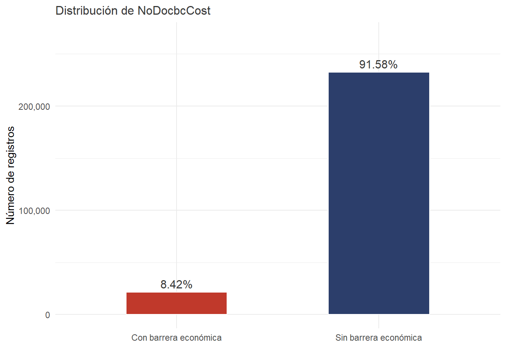

``` r
r$tabla %>% kable() %>% kable_styling(bootstrap_options="striped", full_width=FALSE)
```

<table class="table table-striped" style="color: black; width: auto !important; margin-left: auto; margin-right: auto;">
 <thead>
  <tr>
   <th style="text-align:left;"> Clase </th>
   <th style="text-align:right;"> Conteo </th>
   <th style="text-align:right;"> Porcentaje (%) </th>
  </tr>
 </thead>
<tbody>
  <tr>
   <td style="text-align:left;"> Sin barrera económica </td>
   <td style="text-align:right;"> 232326 </td>
   <td style="text-align:right;"> 91.58 </td>
  </tr>
  <tr>
   <td style="text-align:left;"> Con barrera económica </td>
   <td style="text-align:right;"> 21354 </td>
   <td style="text-align:right;"> 8.42 </td>
  </tr>
</tbody>
</table>

El 91.58% (232.326 personas) no enfrentó barreras económicas para acceder al médico en el último año.

#### DiffWalk: Dificultad al caminar


``` r
r <- plot_binaria("DiffWalk", c("Sin dificultad al caminar","Con dificultad al caminar"), "Distribución de DiffWalk")
print(r$plot)
```

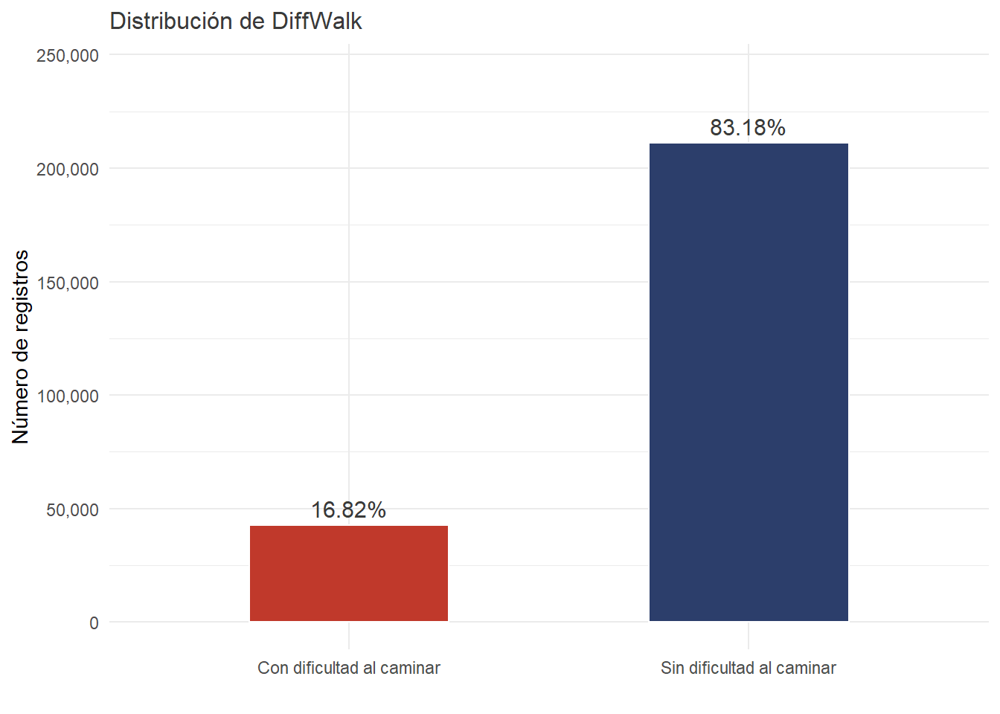

``` r
r$tabla %>% kable() %>% kable_styling(bootstrap_options="striped", full_width=FALSE)
```

<table class="table table-striped" style="color: black; width: auto !important; margin-left: auto; margin-right: auto;">
 <thead>
  <tr>
   <th style="text-align:left;"> Clase </th>
   <th style="text-align:right;"> Conteo </th>
   <th style="text-align:right;"> Porcentaje (%) </th>
  </tr>
 </thead>
<tbody>
  <tr>
   <td style="text-align:left;"> Sin dificultad al caminar </td>
   <td style="text-align:right;"> 211005 </td>
   <td style="text-align:right;"> 83.18 </td>
  </tr>
  <tr>
   <td style="text-align:left;"> Con dificultad al caminar </td>
   <td style="text-align:right;"> 42675 </td>
   <td style="text-align:right;"> 16.82 </td>
  </tr>
</tbody>
</table>

El 83.18% (211.005 personas) no presenta dificultad para caminar; el 16.82% (42.675 personas) sí la reporta.

#### Sex: Sexo


``` r
r <- plot_binaria("Sex", c("Mujer","Hombre"), "Distribución de Sex")
print(r$plot)
```


``` r
r$tabla %>% kable() %>% kable_styling(bootstrap_options="striped", full_width=FALSE)
```

<table class="table table-striped" style="color: black; width: auto !important; margin-left: auto; margin-right: auto;">
 <thead>
  <tr>
   <th style="text-align:left;"> Clase </th>
   <th style="text-align:right;"> Conteo </th>
   <th style="text-align:right;"> Porcentaje (%) </th>
  </tr>
 </thead>
<tbody>
  <tr>
   <td style="text-align:left;"> Mujer </td>
   <td style="text-align:right;"> 141974 </td>
   <td style="text-align:right;"> 55.97 </td>
  </tr>
  <tr>
   <td style="text-align:left;"> Hombre </td>
   <td style="text-align:right;"> 111706 </td>
   <td style="text-align:right;"> 44.03 </td>
  </tr>
</tbody>
</table>

El 55.97% (141.974 personas) son mujeres y el 44.03% (111.706 personas) son hombres.

### Variables Ordinales


``` r
# Función auxiliar para variables ordinales (barras horizontales)
plot_ordinal <- function(var, etiquetas, titulo, colores=NULL) {
  conteos <- df %>%
    count(.data[[var]]) %>%
    mutate(
      Categoria  = etiquetas,
      Porcentaje = round(n / sum(n) * 100, 2)
    )

  if (is.null(colores)) colores <- rep(col_azul, nrow(conteos))

  ggplot(conteos, aes(x=n, y=Categoria, fill=Categoria)) +
    geom_col(width=0.5, color="white") +
    geom_text(aes(label=paste0(Porcentaje, "%")), hjust=-0.1, size=3.5, color="#3a3a3a") +
    scale_fill_manual(values=colores) +
    scale_x_continuous(labels=label_comma(), limits=c(0, max(conteos$n)*1.2)) +
    labs(title=titulo, x="Número de registros", y="") +
    theme_minimal() +
    theme(legend.position="none", plot.title=element_text(color="#3a3a3a", size=12))
}
```

#### Diabetes


``` r
plot_ordinal("Diabetes",
  c("Sin diabetes","Prediabetes","Diabetes confirmada"),
  "Distribución de Diabetes",
  colores=c(col_rojo, col_azul, col_verde))
```

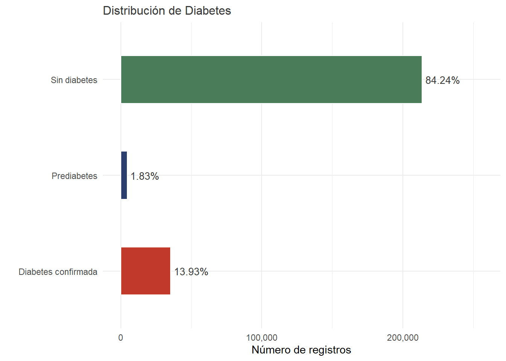

El 84.24% (213.703 personas) no presenta diabetes, el 13.93% (35.346 personas) tiene diabetes confirmada y apenas el 1.83% (4.631 personas) se encuentra en estado de prediabetes.

#### GenHlth: Autopercepción de salud general


``` r
plot_ordinal("GenHlth",
  c("Excelente","Muy buena","Buena","Regular","Mala"),
  "Distribución de GenHlth",
  colores=c(col_rojo, col_azul, col_verde, "#8B6914", "#6B3A5A"))
```

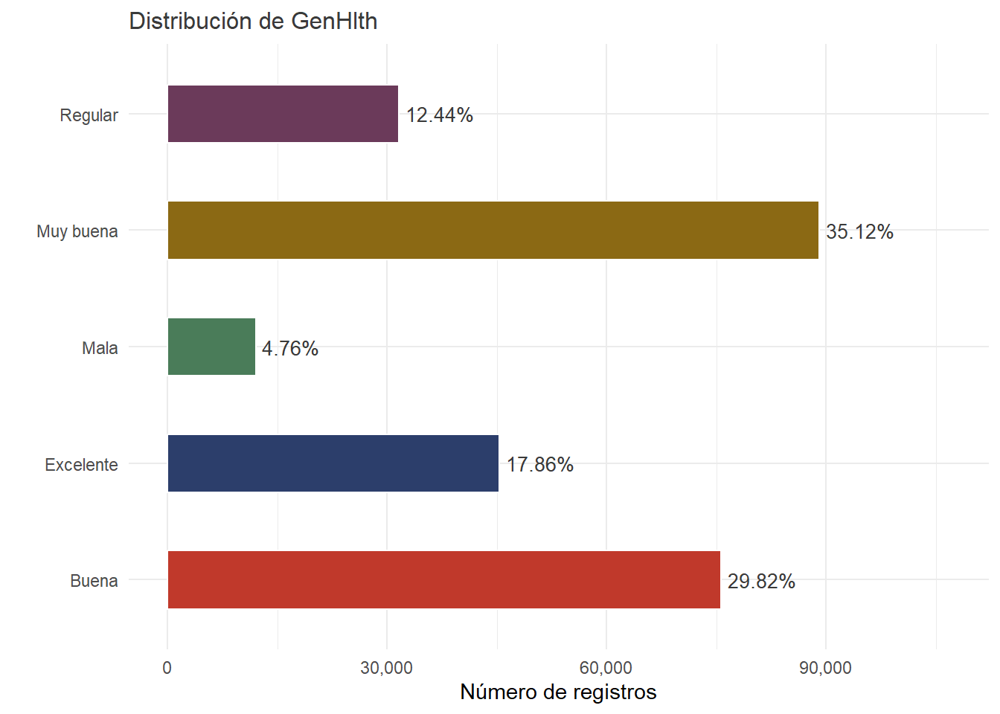

El 35.12% califica su salud como muy buena y el 17.86% como excelente, sumando más de la mitad de la muestra en las dos categorías más favorables.

#### Age: Edad


``` r
plot_ordinal("Age",
  c("18–24","25–29","30–34","35–39","40–44","45–49",
    "50–54","55–59","60–64","65–69","70–74","75–79","80+"),
  "Distribución de Age (Grupo etario)")
```

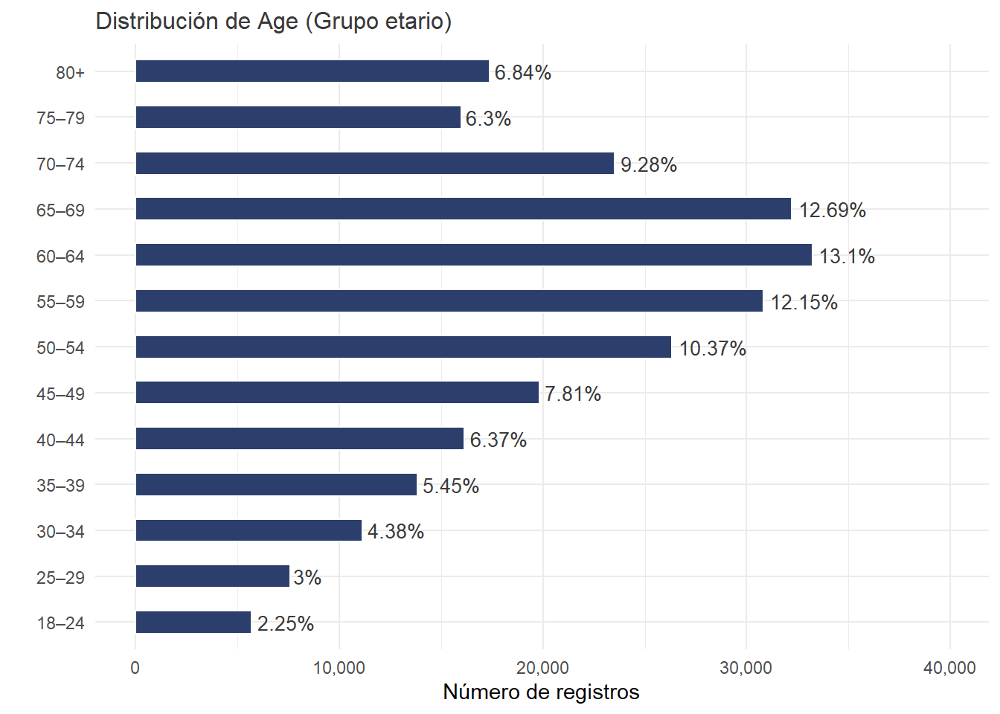

Los grupos con mayor representación son 60–64 años (13.10%), 55–59 años (12.15%) y 65–69 años (12.69%), concentrando casi el 38% de la muestra.

#### Education: Educación


``` r
plot_ordinal("Education",
  c("Nunca asistió","Primaria incompleta","Secundaria incompleta",
    "Secundaria completa","Universidad incompleta","Universidad completa"),
  "Distribución de Education")
```

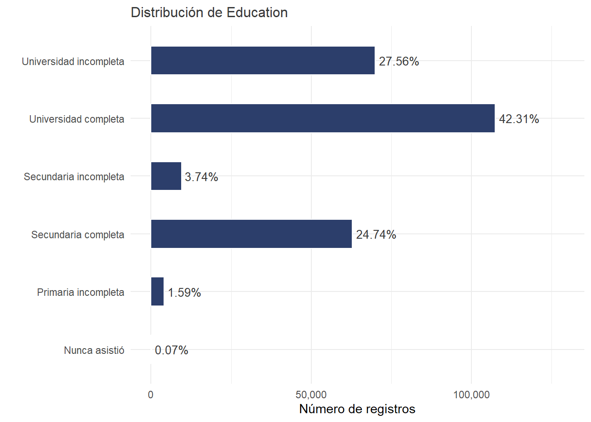

El 42.31% completó la universidad, siendo el grupo más numeroso. Junto con universidad incompleta (27.56%) representan casi el 70% de la muestra.

#### Income: Ingreso Anual


``` r
plot_ordinal("Income",
  c("< $10,000","$10,000–15,000","$15,000–20,000","$20,000–25,000",
    "$25,000–35,000","$35,000–50,000","$50,000–75,000","$75,000+"),
  "Distribución de Income")
```

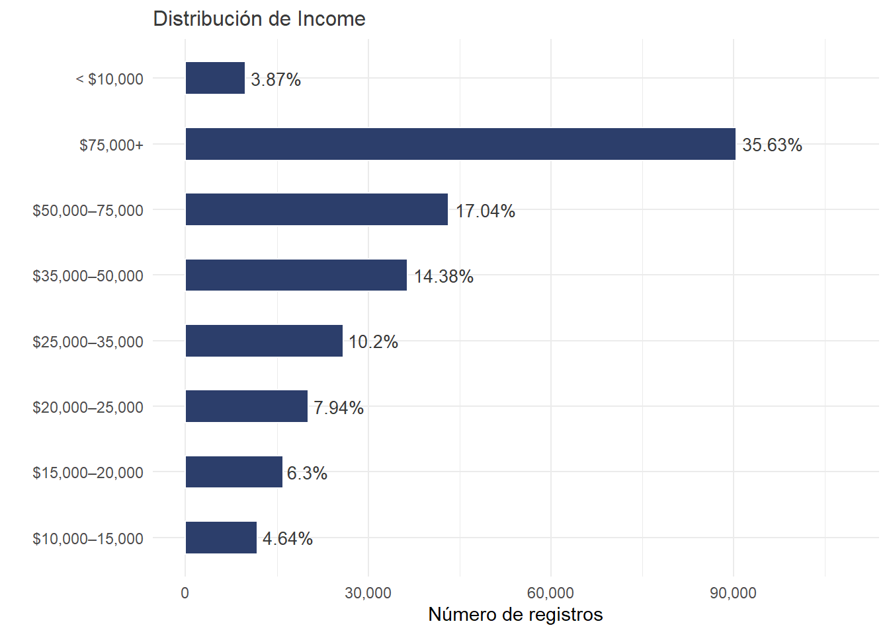

El 35.63% (90.385 personas) reporta ingresos de $75.000 o más, siendo el grupo más numeroso con amplia diferencia.

### Variables Continuas

#### BMI: Índice de Masa Corporal


``` r
q1_bmi  <- quantile(df$BMI, 0.25)
q3_bmi  <- quantile(df$BMI, 0.75)
iqr_bmi <- q3_bmi - q1_bmi

tibble(
  Métrica = c("Conteo","Media","Desv. estándar","Mínimo","Q1 (25%)",
              "Mediana (50%)","Q3 (75%)","Máximo","IQR",
              "Límite inferior","Límite superior","N° outliers","% outliers"),
  Valor   = c(
    format(nrow(df), big.mark="."),
    round(mean(df$BMI), 2),
    round(sd(df$BMI), 2),
    min(df$BMI),
    q1_bmi,
    median(df$BMI),
    q3_bmi,
    max(df$BMI),
    iqr_bmi,
    round(q1_bmi - 1.5*iqr_bmi, 1),
    round(q3_bmi + 1.5*iqr_bmi, 1),
    format(sum(df$BMI < q1_bmi - 1.5*iqr_bmi | df$BMI > q3_bmi + 1.5*iqr_bmi), big.mark="."),
    paste0(round(mean(df$BMI < q1_bmi - 1.5*iqr_bmi | df$BMI > q3_bmi + 1.5*iqr_bmi)*100, 2), "%")
  )
) %>%
  kable(caption="Estadísticas descriptivas — BMI") %>%
  kable_styling(bootstrap_options="striped", full_width=FALSE)
```

<table class="table table-striped" style="color: black; width: auto !important; margin-left: auto; margin-right: auto;">
<caption>(\#tab:bmi_stats)(\#tab:bmi_stats)Estadísticas descriptivas — BMI</caption>
 <thead>
  <tr>
   <th style="text-align:left;"> Métrica </th>
   <th style="text-align:left;"> Valor </th>
  </tr>
 </thead>
<tbody>
  <tr>
   <td style="text-align:left;"> Conteo </td>
   <td style="text-align:left;"> 253.680 </td>
  </tr>
  <tr>
   <td style="text-align:left;"> Media </td>
   <td style="text-align:left;"> 28.38 </td>
  </tr>
  <tr>
   <td style="text-align:left;"> Desv. estándar </td>
   <td style="text-align:left;"> 6.61 </td>
  </tr>
  <tr>
   <td style="text-align:left;"> Mínimo </td>
   <td style="text-align:left;"> 12 </td>
  </tr>
  <tr>
   <td style="text-align:left;"> Q1 (25%) </td>
   <td style="text-align:left;"> 24 </td>
  </tr>
  <tr>
   <td style="text-align:left;"> Mediana (50%) </td>
   <td style="text-align:left;"> 27 </td>
  </tr>
  <tr>
   <td style="text-align:left;"> Q3 (75%) </td>
   <td style="text-align:left;"> 31 </td>
  </tr>
  <tr>
   <td style="text-align:left;"> Máximo </td>
   <td style="text-align:left;"> 98 </td>
  </tr>
  <tr>
   <td style="text-align:left;"> IQR </td>
   <td style="text-align:left;"> 7 </td>
  </tr>
  <tr>
   <td style="text-align:left;"> Límite inferior </td>
   <td style="text-align:left;"> 13.5 </td>
  </tr>
  <tr>
   <td style="text-align:left;"> Límite superior </td>
   <td style="text-align:left;"> 41.5 </td>
  </tr>
  <tr>
   <td style="text-align:left;"> N° outliers </td>
   <td style="text-align:left;"> 9.847 </td>
  </tr>
  <tr>
   <td style="text-align:left;"> % outliers </td>
   <td style="text-align:left;"> 3.88% </td>
  </tr>
</tbody>
</table>

El BMI presenta una media de 28.38 y mediana de 27.0, con leve asimetría positiva. El 50% central se ubica entre 24.0 y 31.0, correspondiente a peso normal alto y sobrepeso.


``` r
ggplot(df, aes(x=BMI)) +
  geom_histogram(bins=50, fill=col_rojo, color="white", alpha=0.9) +
  geom_vline(xintercept=mean(df$BMI), color=col_azul, linetype="dashed", linewidth=1.2,
             aes_string()) +
  geom_vline(xintercept=median(df$BMI), color=col_verde, linetype="dotdash", linewidth=1.2) +
  annotate("text", x=mean(df$BMI)+1, y=Inf, vjust=2,
           label=paste0("Media: ", round(mean(df$BMI),2)), color=col_azul, size=3.5) +
  annotate("text", x=median(df$BMI)-1, y=Inf, vjust=4,
           label=paste0("Mediana: ", median(df$BMI)), color=col_verde, size=3.5, hjust=1) +
  scale_y_continuous(labels=label_comma()) +
  labs(title="Distribución de BMI (Índice de masa corporal)", x="BMI", y="Frecuencia") +
  theme_minimal() +
  theme(plot.title=element_text(color="#3a3a3a", size=12))
```

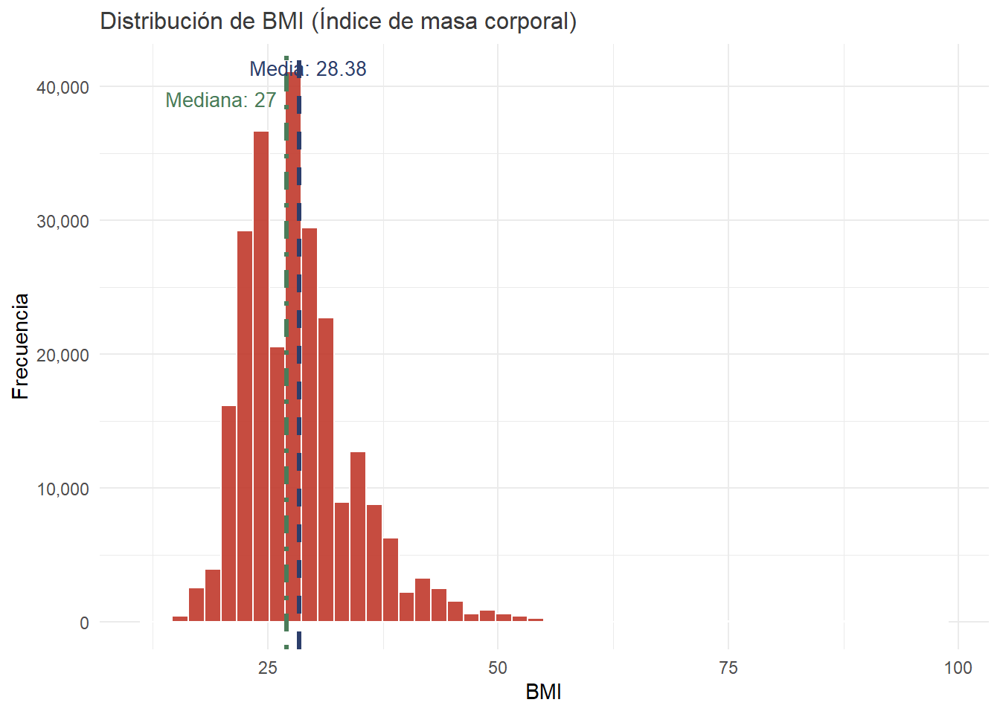

La distribución presenta asimetría positiva, con la mayor concentración entre 22 y 32.

#### MentHlth: Días con mala salud mental


``` r
conteos_mh <- df %>% count(MentHlth) %>%
  mutate(Porcentaje = round(n/sum(n)*100, 1))

ggplot(conteos_mh, aes(x=MentHlth, y=n)) +
  geom_col(fill=col_rojo, color="white", alpha=0.9, width=0.7) +
  geom_text(data=filter(conteos_mh, Porcentaje >= 0.5),
            aes(label=paste0(Porcentaje,"%")), vjust=-0.4, size=2.5, color="#3a3a3a") +
  scale_x_continuous(breaks=0:30) +
  scale_y_continuous(labels=label_comma()) +
  labs(title="Distribución de MentHlth (Días con mala salud mental)",
       x="Número de días", y="Frecuencia") +
  theme_minimal() +
  theme(plot.title=element_text(color="#3a3a3a", size=12))
```

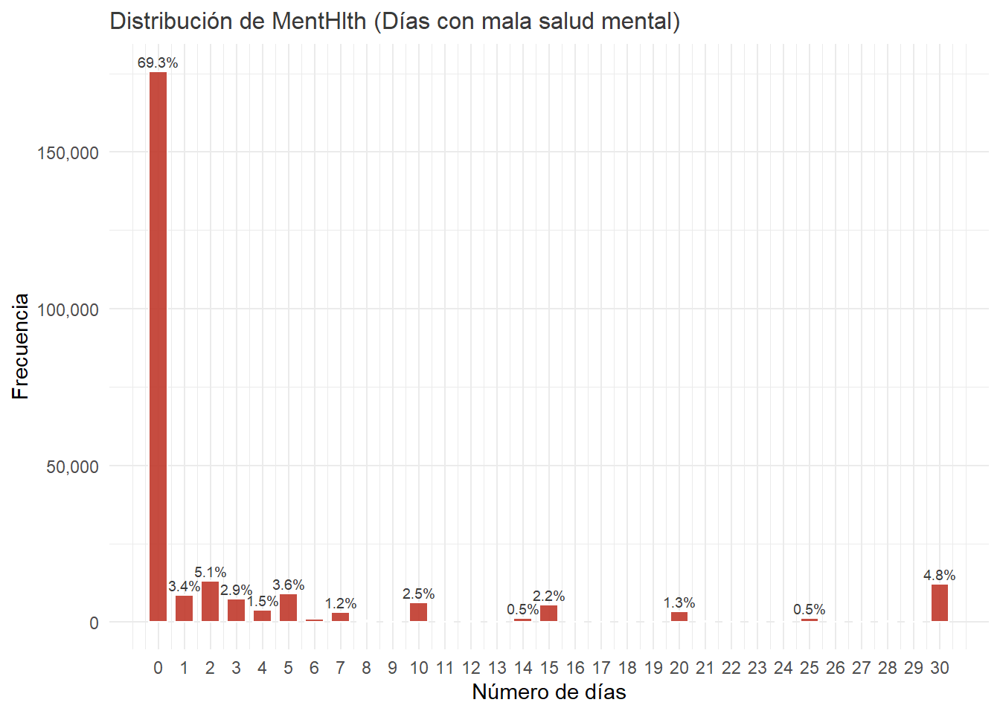

El 69.3% reportó 0 días de mala salud mental. Se observan repuntes en valores redondos (5, 10, 15, 30 días), típicos del autoreporte.

#### PhysHlth: Días con mala salud física


``` r
conteos_ph <- df %>% count(PhysHlth) %>%
  mutate(Porcentaje = round(n/sum(n)*100, 1))

ggplot(conteos_ph, aes(x=PhysHlth, y=n)) +
  geom_col(fill=col_azul, color="white", alpha=0.9, width=0.7) +
  geom_text(data=filter(conteos_ph, Porcentaje >= 0.5),
            aes(label=paste0(Porcentaje,"%")), vjust=-0.4, size=2.5, color="#3a3a3a") +
  scale_x_continuous(breaks=0:30) +
  scale_y_continuous(labels=label_comma()) +
  labs(title="Distribución de PhysHlth (Días con mala salud física)",
       x="Número de días", y="Frecuencia") +
  theme_minimal() +
  theme(plot.title=element_text(color="#3a3a3a", size=12))
```

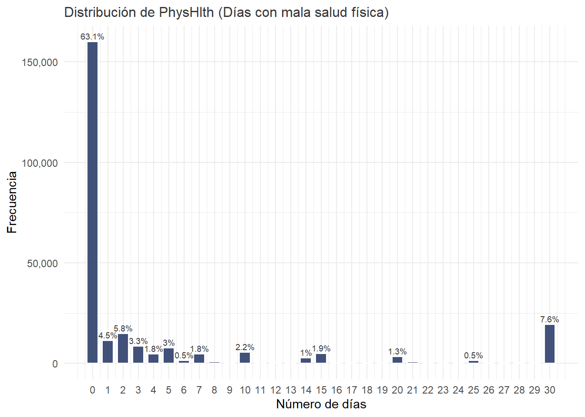

El 63.1% reportó 0 días de mala salud física. El valor 30 días alcanza el 7.6%, el más alto después del 0.

---

## Análisis Bivariado

Para examinar la relación entre cada variable predictora y `HeartDiseaseorAttack` se emplean: Chi-cuadrado + V de Cramér para binarias y ordinales, y Mann-Whitney U + correlación de Pearson para continuas.

### Correlación global con la variable objetivo


``` r
corr_df <- df %>%
  select(all_of(c(target_var, binary_vars, ordinal_vars, continuous_vars))) %>%
  mutate(across(everything(), as.numeric)) %>%
  cor(use="complete.obs")

corr_target <- sort(corr_df[target_var, -1], decreasing=TRUE)

tibble(Variable=names(corr_target), Correlacion=round(corr_target, 3)) %>%
  ggplot(aes(x=Correlacion, y=reorder(Variable, Correlacion),
             fill=ifelse(Correlacion>0, "pos","neg"))) +
  geom_col(color="white", width=0.65) +
  geom_text(aes(label=round(Correlacion,3),
                hjust=ifelse(Correlacion>=0,-0.1,1.1)),
            size=3, color="#3a3a3a") +
  geom_vline(xintercept=0, linetype="dashed", color="#3a3a3a", linewidth=0.7) +
  scale_fill_manual(values=c("pos"=col_rojo,"neg"=col_azul)) +
  labs(title="Correlación de Pearson con HeartDiseaseorAttack",
       x="Correlación", y="") +
  theme_minimal() +
  theme(legend.position="none", plot.title=element_text(color="#3a3a3a", size=12))
```

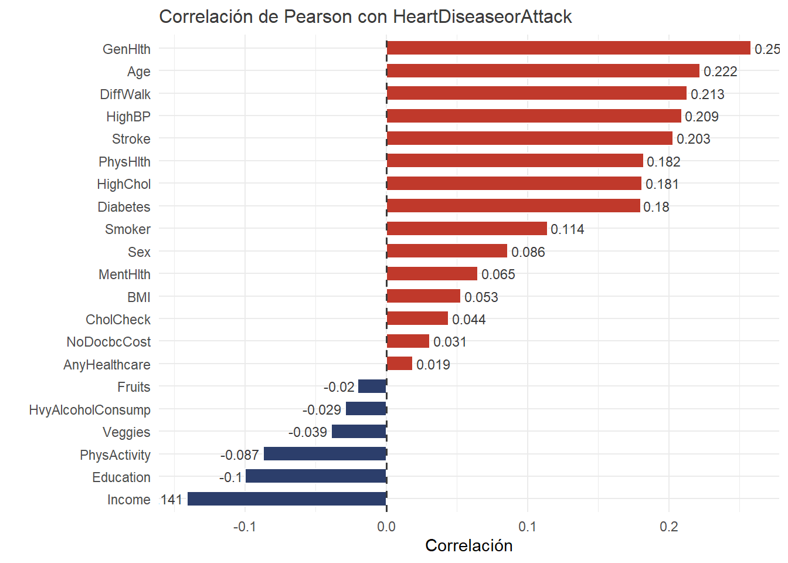

Las correlaciones más altas son **GenHlth** (0.258), **Age** (0.222), **DiffWalk** (0.213), **HighBP** (0.209) y **Stroke** (0.203). Las negativas más relevantes son **Income** (−0.141), **Education** (−0.100) y **PhysActivity** (−0.087).

### Variables Binarias


``` r
# Función bivariada para variables binarias
biv_binaria <- function(var, etiquetas, titulo) {
  tasa <- df %>%
    group_by(.data[[var]]) %>%
    summarise(tasa = mean(HeartDiseaseorAttack) * 100, .groups="drop") %>%
    mutate(Categoria = etiquetas)

  ct     <- table(df[[var]], df[[target_var]])
  chi2   <- chisq.test(ct)
  n      <- sum(ct)
  cramer <- sqrt(chi2$statistic / (n * (min(dim(ct)) - 1)))

  p <- ggplot(tasa, aes(x=Categoria, y=tasa, fill=Categoria)) +
    geom_col(width=0.45, color="white") +
    geom_text(aes(label=paste0(round(tasa,1),"%")), vjust=-0.5, size=4, color="#3a3a3a") +
    scale_fill_manual(values=c(col_azul, col_rojo)) +
    scale_y_continuous(limits=c(0, max(tasa$tasa)*1.3)) +
    labs(title=paste(titulo, "vs HD"), x="", y="% con enfermedad cardíaca") +
    theme_minimal() + theme(legend.position="none",
                            plot.title=element_text(color="#3a3a3a", size=11))

  metricas <- tibble(
    Métrica = c("Chi²","p-valor","V de Cramér",
                paste0("Tasa (",etiquetas[1],")"),
                paste0("Tasa (",etiquetas[2],")")),
    Valor   = c(round(chi2$statistic,1), format(chi2$p.value, scientific=TRUE, digits=3),
                round(as.numeric(cramer),4),
                paste0(round(tasa$tasa[1],2),"%"),
                paste0(round(tasa$tasa[2],2),"%"))
  )
  list(plot=p, metricas=metricas)
}
```

#### HighBP


``` r
r <- biv_binaria("HighBP", c("Sin hipertensión","Con hipertensión"), "HighBP")
print(r$plot)
```

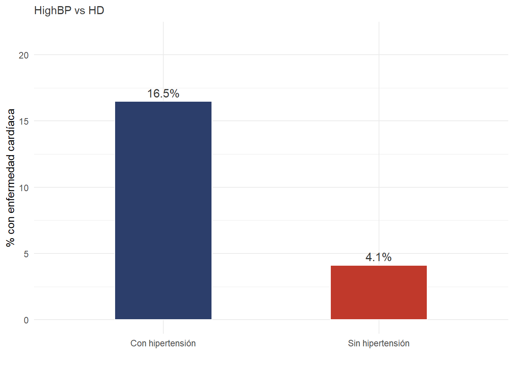

``` r
r$metricas %>% kable() %>% kable_styling(bootstrap_options="striped", full_width=FALSE)
```

<table class="table table-striped" style="color: black; width: auto !important; margin-left: auto; margin-right: auto;">
 <thead>
  <tr>
   <th style="text-align:left;"> Métrica </th>
   <th style="text-align:left;"> Valor </th>
  </tr>
 </thead>
<tbody>
  <tr>
   <td style="text-align:left;"> Chi² </td>
   <td style="text-align:left;"> 11117.9 </td>
  </tr>
  <tr>
   <td style="text-align:left;"> p-valor </td>
   <td style="text-align:left;"> 0e+00 </td>
  </tr>
  <tr>
   <td style="text-align:left;"> V de Cramér </td>
   <td style="text-align:left;"> 0.2093 </td>
  </tr>
  <tr>
   <td style="text-align:left;"> Tasa (Sin hipertensión) </td>
   <td style="text-align:left;"> 4.12% </td>
  </tr>
  <tr>
   <td style="text-align:left;"> Tasa (Con hipertensión) </td>
   <td style="text-align:left;"> 16.47% </td>
  </tr>
</tbody>
</table>

La hipertensión **cuadruplica** la tasa de enfermedad cardíaca (16.47% vs 4.12%). Con V de Cramér de 0.2093, es la segunda variable binaria con mayor asociación.

#### HighChol


``` r
r <- biv_binaria("HighChol", c("Sin colesterol alto","Con colesterol alto"), "HighChol")
print(r$plot)
```


``` r
r$metricas %>% kable() %>% kable_styling(bootstrap_options="striped", full_width=FALSE)
```

<table class="table table-striped" style="color: black; width: auto !important; margin-left: auto; margin-right: auto;">
 <thead>
  <tr>
   <th style="text-align:left;"> Métrica </th>
   <th style="text-align:left;"> Valor </th>
  </tr>
 </thead>
<tbody>
  <tr>
   <td style="text-align:left;"> Chi² </td>
   <td style="text-align:left;"> 8288 </td>
  </tr>
  <tr>
   <td style="text-align:left;"> p-valor </td>
   <td style="text-align:left;"> 0e+00 </td>
  </tr>
  <tr>
   <td style="text-align:left;"> V de Cramér </td>
   <td style="text-align:left;"> 0.1808 </td>
  </tr>
  <tr>
   <td style="text-align:left;"> Tasa (Sin colesterol alto) </td>
   <td style="text-align:left;"> 4.89% </td>
  </tr>
  <tr>
   <td style="text-align:left;"> Tasa (Con colesterol alto) </td>
   <td style="text-align:left;"> 15.57% </td>
  </tr>
</tbody>
</table>

El colesterol alto **triplica** la tasa de HD (15.57% vs 4.89%), con V=0.1808.

#### CholCheck


``` r
r <- biv_binaria("CholCheck", c("Sin chequeo en 5 años","Con chequeo en 5 años"), "CholCheck")
print(r$plot)
```

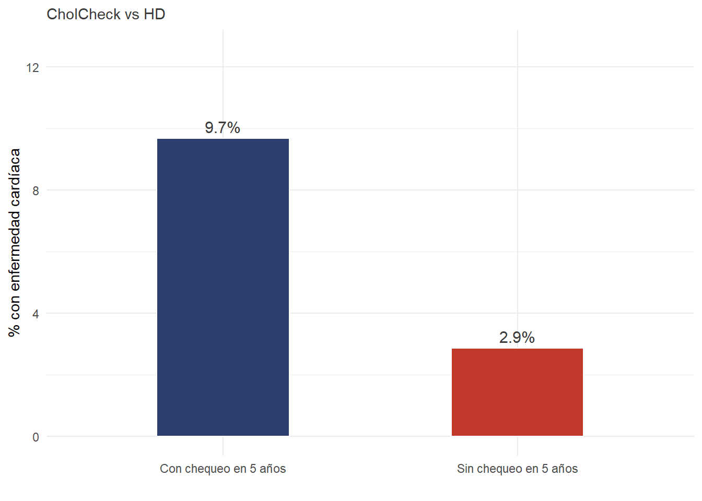

``` r
r$metricas %>% kable() %>% kable_styling(bootstrap_options="striped", full_width=FALSE)
```

<table class="table table-striped" style="color: black; width: auto !important; margin-left: auto; margin-right: auto;">
 <thead>
  <tr>
   <th style="text-align:left;"> Métrica </th>
   <th style="text-align:left;"> Valor </th>
  </tr>
 </thead>
<tbody>
  <tr>
   <td style="text-align:left;"> Chi² </td>
   <td style="text-align:left;"> 494.9 </td>
  </tr>
  <tr>
   <td style="text-align:left;"> p-valor </td>
   <td style="text-align:left;"> 1.2e-109 </td>
  </tr>
  <tr>
   <td style="text-align:left;"> V de Cramér </td>
   <td style="text-align:left;"> 0.0442 </td>
  </tr>
  <tr>
   <td style="text-align:left;"> Tasa (Sin chequeo en 5 años) </td>
   <td style="text-align:left;"> 2.86% </td>
  </tr>
  <tr>
   <td style="text-align:left;"> Tasa (Con chequeo en 5 años) </td>
   <td style="text-align:left;"> 9.67% </td>
  </tr>
</tbody>
</table>

La asociación es débil (V=0.0442) y refleja un sesgo de detección: quienes se chequearon tienen más diagnósticos por mayor exposición al sistema de salud.

#### Smoker


``` r
r <- biv_binaria("Smoker", c("No fumador","Fumador"), "Smoker")
print(r$plot)
```

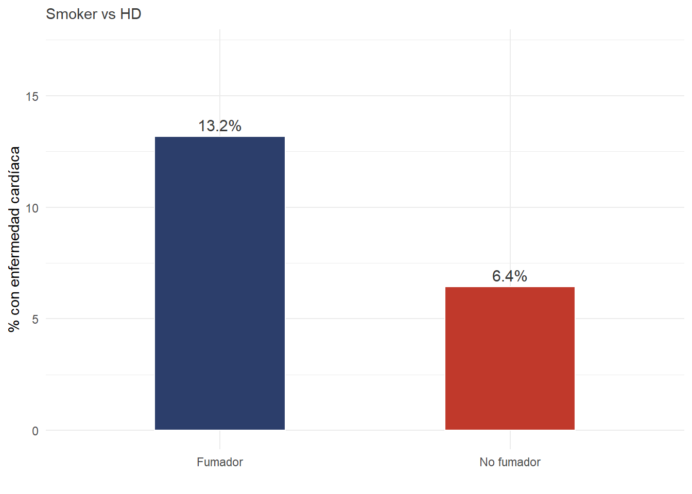

``` r
r$metricas %>% kable() %>% kable_styling(bootstrap_options="striped", full_width=FALSE)
```

<table class="table table-striped" style="color: black; width: auto !important; margin-left: auto; margin-right: auto;">
 <thead>
  <tr>
   <th style="text-align:left;"> Métrica </th>
   <th style="text-align:left;"> Valor </th>
  </tr>
 </thead>
<tbody>
  <tr>
   <td style="text-align:left;"> Chi² </td>
   <td style="text-align:left;"> 3321.6 </td>
  </tr>
  <tr>
   <td style="text-align:left;"> p-valor </td>
   <td style="text-align:left;"> 0e+00 </td>
  </tr>
  <tr>
   <td style="text-align:left;"> V de Cramér </td>
   <td style="text-align:left;"> 0.1144 </td>
  </tr>
  <tr>
   <td style="text-align:left;"> Tasa (No fumador) </td>
   <td style="text-align:left;"> 6.44% </td>
  </tr>
  <tr>
   <td style="text-align:left;"> Tasa (Fumador) </td>
   <td style="text-align:left;"> 13.17% </td>
  </tr>
</tbody>
</table>

Los fumadores **duplican** la tasa de HD (13.17% vs 6.44%), con V=0.1144.

#### Stroke


``` r
r <- biv_binaria("Stroke", c("Sin ACV","Con ACV"), "Stroke")
print(r$plot)
```

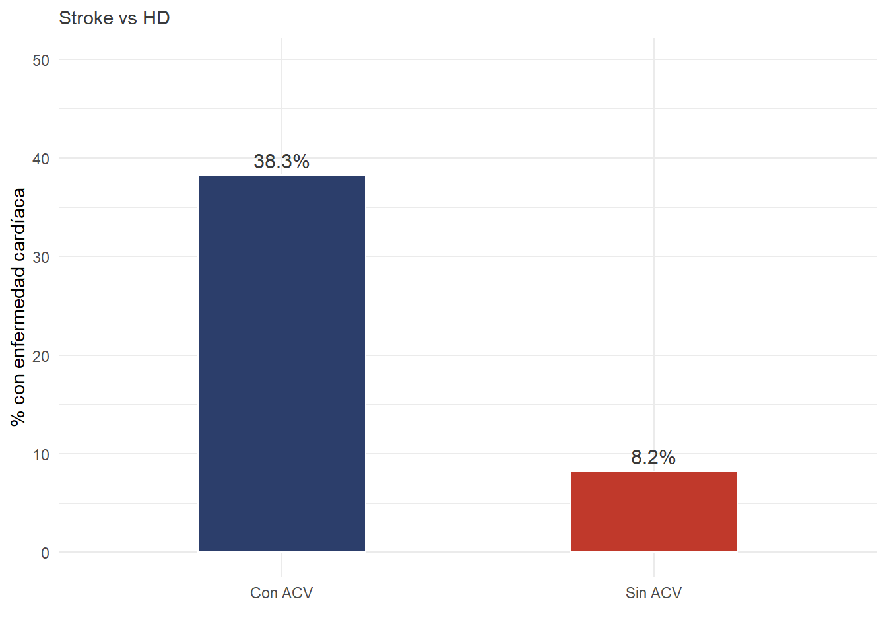

``` r
r$metricas %>% kable() %>% kable_styling(bootstrap_options="striped", full_width=FALSE)
```

<table class="table table-striped" style="color: black; width: auto !important; margin-left: auto; margin-right: auto;">
 <thead>
  <tr>
   <th style="text-align:left;"> Métrica </th>
   <th style="text-align:left;"> Valor </th>
  </tr>
 </thead>
<tbody>
  <tr>
   <td style="text-align:left;"> Chi² </td>
   <td style="text-align:left;"> 10450.6 </td>
  </tr>
  <tr>
   <td style="text-align:left;"> p-valor </td>
   <td style="text-align:left;"> 0e+00 </td>
  </tr>
  <tr>
   <td style="text-align:left;"> V de Cramér </td>
   <td style="text-align:left;"> 0.203 </td>
  </tr>
  <tr>
   <td style="text-align:left;"> Tasa (Sin ACV) </td>
   <td style="text-align:left;"> 8.2% </td>
  </tr>
  <tr>
   <td style="text-align:left;"> Tasa (Con ACV) </td>
   <td style="text-align:left;"> 38.25% </td>
  </tr>
</tbody>
</table>

El antecedente de ACV tiene la **tasa absoluta más alta** entre las variables binarias (38.25%), con V=0.2030.

#### PhysActivity


``` r
r <- biv_binaria("PhysActivity", c("Sin actividad física","Con actividad física"), "PhysActivity")
print(r$plot)
```

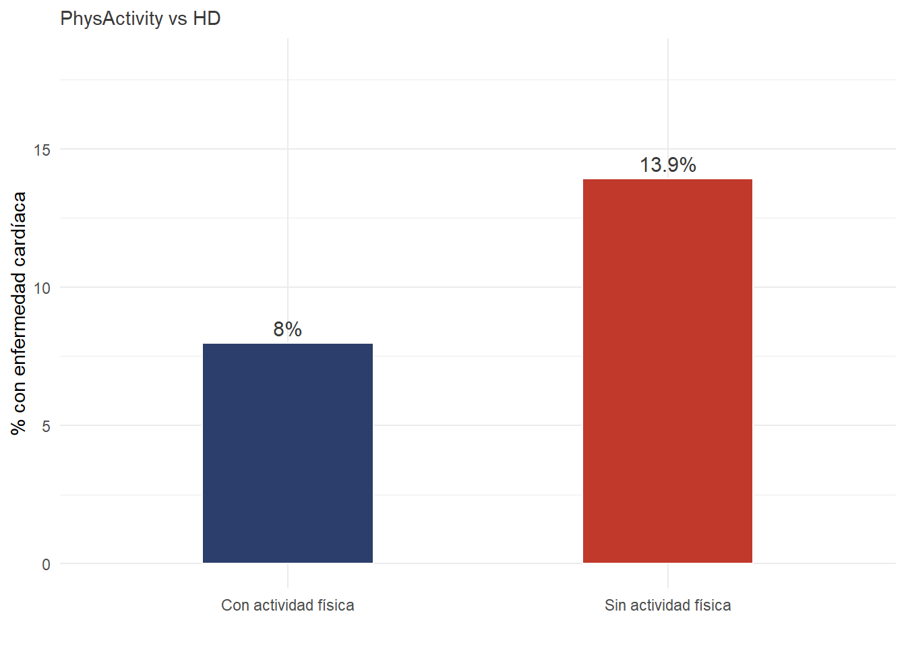

``` r
r$metricas %>% kable() %>% kable_styling(bootstrap_options="striped", full_width=FALSE)
```

<table class="table table-striped" style="color: black; width: auto !important; margin-left: auto; margin-right: auto;">
 <thead>
  <tr>
   <th style="text-align:left;"> Métrica </th>
   <th style="text-align:left;"> Valor </th>
  </tr>
 </thead>
<tbody>
  <tr>
   <td style="text-align:left;"> Chi² </td>
   <td style="text-align:left;"> 1932.6 </td>
  </tr>
  <tr>
   <td style="text-align:left;"> p-valor </td>
   <td style="text-align:left;"> 0e+00 </td>
  </tr>
  <tr>
   <td style="text-align:left;"> V de Cramér </td>
   <td style="text-align:left;"> 0.0873 </td>
  </tr>
  <tr>
   <td style="text-align:left;"> Tasa (Sin actividad física) </td>
   <td style="text-align:left;"> 13.91% </td>
  </tr>
  <tr>
   <td style="text-align:left;"> Tasa (Con actividad física) </td>
   <td style="text-align:left;"> 7.97% </td>
  </tr>
</tbody>
</table>

La inactividad física **casi duplica** la tasa de HD (13.91% vs 7.97%), con V=0.0873.

#### Fruits


``` r
r <- biv_binaria("Fruits", c("No consume frutas","Consume frutas diario"), "Fruits")
print(r$plot)
```

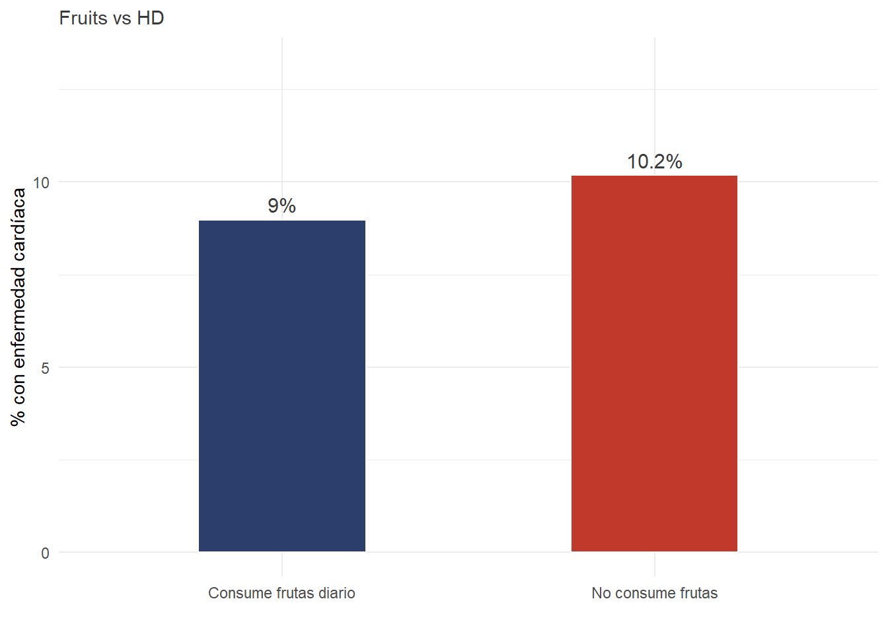

``` r
r$metricas %>% kable() %>% kable_styling(bootstrap_options="striped", full_width=FALSE)
```

<table class="table table-striped" style="color: black; width: auto !important; margin-left: auto; margin-right: auto;">
 <thead>
  <tr>
   <th style="text-align:left;"> Métrica </th>
   <th style="text-align:left;"> Valor </th>
  </tr>
 </thead>
<tbody>
  <tr>
   <td style="text-align:left;"> Chi² </td>
   <td style="text-align:left;"> 99.2 </td>
  </tr>
  <tr>
   <td style="text-align:left;"> p-valor </td>
   <td style="text-align:left;"> 2.27e-23 </td>
  </tr>
  <tr>
   <td style="text-align:left;"> V de Cramér </td>
   <td style="text-align:left;"> 0.0198 </td>
  </tr>
  <tr>
   <td style="text-align:left;"> Tasa (No consume frutas) </td>
   <td style="text-align:left;"> 10.18% </td>
  </tr>
  <tr>
   <td style="text-align:left;"> Tasa (Consume frutas diario) </td>
   <td style="text-align:left;"> 8.98% </td>
  </tr>
</tbody>
</table>

Asociación muy débil (V=0.0198); la diferencia de tasas es marginal (10.18% vs 8.98%).

#### Veggies


``` r
r <- biv_binaria("Veggies", c("No consume verduras","Consume verduras diario"), "Veggies")
print(r$plot)
```

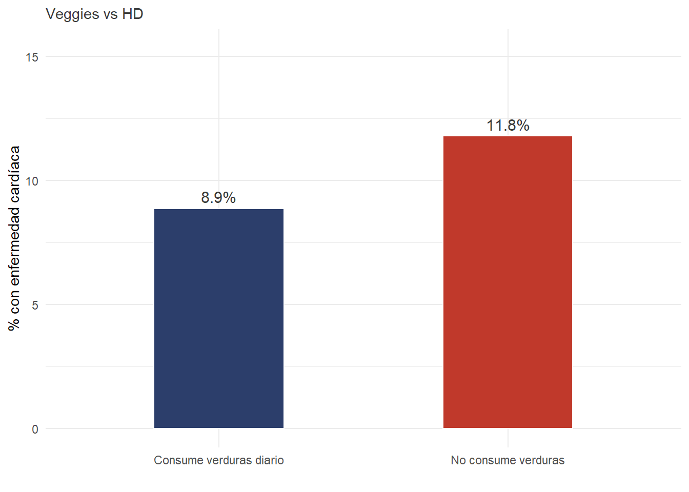

``` r
r$metricas %>% kable() %>% kable_styling(bootstrap_options="striped", full_width=FALSE)
```

<table class="table table-striped" style="color: black; width: auto !important; margin-left: auto; margin-right: auto;">
 <thead>
  <tr>
   <th style="text-align:left;"> Métrica </th>
   <th style="text-align:left;"> Valor </th>
  </tr>
 </thead>
<tbody>
  <tr>
   <td style="text-align:left;"> Chi² </td>
   <td style="text-align:left;"> 388.8 </td>
  </tr>
  <tr>
   <td style="text-align:left;"> p-valor </td>
   <td style="text-align:left;"> 1.49e-86 </td>
  </tr>
  <tr>
   <td style="text-align:left;"> V de Cramér </td>
   <td style="text-align:left;"> 0.0392 </td>
  </tr>
  <tr>
   <td style="text-align:left;"> Tasa (No consume verduras) </td>
   <td style="text-align:left;"> 11.79% </td>
  </tr>
  <tr>
   <td style="text-align:left;"> Tasa (Consume verduras diario) </td>
   <td style="text-align:left;"> 8.87% </td>
  </tr>
</tbody>
</table>

Asociación significativa pero de magnitud baja (V=0.0392).

#### HvyAlcoholConsump


``` r
r <- biv_binaria("HvyAlcoholConsump", c("Sin consumo excesivo","Consumo excesivo"), "HvyAlcoholConsump")
print(r$plot)
```

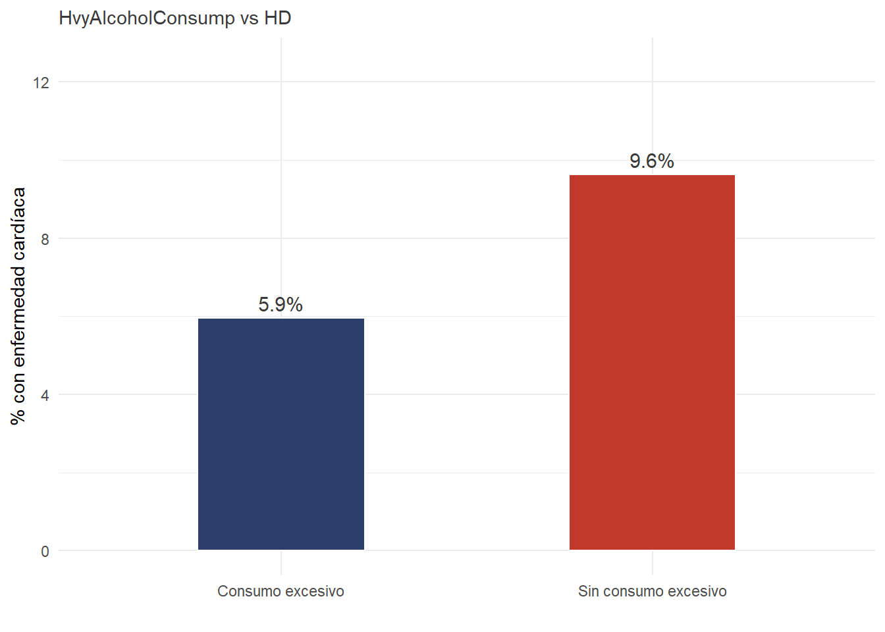

``` r
r$metricas %>% kable() %>% kable_styling(bootstrap_options="striped", full_width=FALSE)
```

<table class="table table-striped" style="color: black; width: auto !important; margin-left: auto; margin-right: auto;">
 <thead>
  <tr>
   <th style="text-align:left;"> Métrica </th>
   <th style="text-align:left;"> Valor </th>
  </tr>
 </thead>
<tbody>
  <tr>
   <td style="text-align:left;"> Chi² </td>
   <td style="text-align:left;"> 212.8 </td>
  </tr>
  <tr>
   <td style="text-align:left;"> p-valor </td>
   <td style="text-align:left;"> 3.41e-48 </td>
  </tr>
  <tr>
   <td style="text-align:left;"> V de Cramér </td>
   <td style="text-align:left;"> 0.029 </td>
  </tr>
  <tr>
   <td style="text-align:left;"> Tasa (Sin consumo excesivo) </td>
   <td style="text-align:left;"> 9.63% </td>
  </tr>
  <tr>
   <td style="text-align:left;"> Tasa (Consumo excesivo) </td>
   <td style="text-align:left;"> 5.95% </td>
  </tr>
</tbody>
</table>

Asociación inversa (V=0.0290): el grupo con consumo excesivo tiene menor tasa, posiblemente por el sesgo del "bebedor enfermo" que reduce su consumo al ser diagnosticado.

#### AnyHealthcare


``` r
r <- biv_binaria("AnyHealthcare", c("Sin cobertura médica","Con cobertura médica"), "AnyHealthcare")
print(r$plot)
```


``` r
r$metricas %>% kable() %>% kable_styling(bootstrap_options="striped", full_width=FALSE)
```

<table class="table table-striped" style="color: black; width: auto !important; margin-left: auto; margin-right: auto;">
 <thead>
  <tr>
   <th style="text-align:left;"> Métrica </th>
   <th style="text-align:left;"> Valor </th>
  </tr>
 </thead>
<tbody>
  <tr>
   <td style="text-align:left;"> Chi² </td>
   <td style="text-align:left;"> 88.7 </td>
  </tr>
  <tr>
   <td style="text-align:left;"> p-valor </td>
   <td style="text-align:left;"> 4.51e-21 </td>
  </tr>
  <tr>
   <td style="text-align:left;"> V de Cramér </td>
   <td style="text-align:left;"> 0.0187 </td>
  </tr>
  <tr>
   <td style="text-align:left;"> Tasa (Sin cobertura médica) </td>
   <td style="text-align:left;"> 7.01% </td>
  </tr>
  <tr>
   <td style="text-align:left;"> Tasa (Con cobertura médica) </td>
   <td style="text-align:left;"> 9.54% </td>
  </tr>
</tbody>
</table>

La V más baja entre las binarias (0.0187), con sesgo de detección similar a CholCheck.

#### NoDocbcCost


``` r
r <- biv_binaria("NoDocbcCost", c("Sin barrera económica","Con barrera económica"), "NoDocbcCost")
print(r$plot)
```

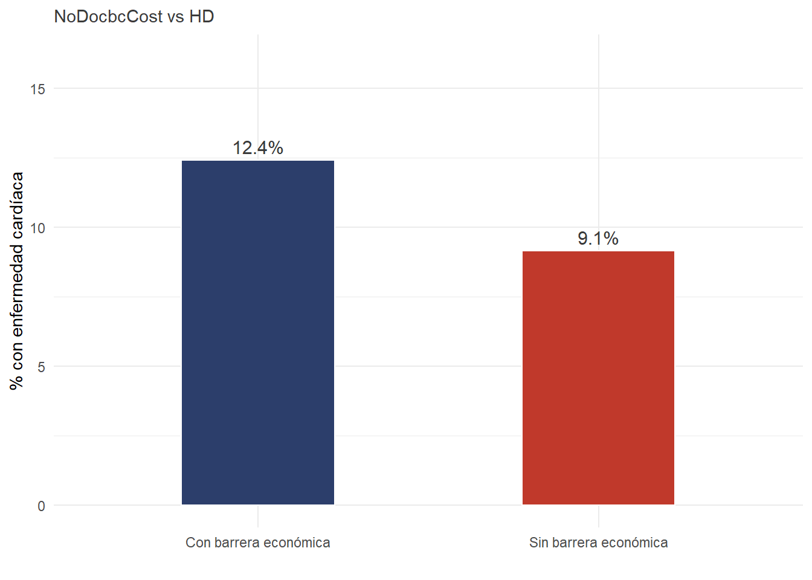

``` r
r$metricas %>% kable() %>% kable_styling(bootstrap_options="striped", full_width=FALSE)
```

<table class="table table-striped" style="color: black; width: auto !important; margin-left: auto; margin-right: auto;">
 <thead>
  <tr>
   <th style="text-align:left;"> Métrica </th>
   <th style="text-align:left;"> Valor </th>
  </tr>
 </thead>
<tbody>
  <tr>
   <td style="text-align:left;"> Chi² </td>
   <td style="text-align:left;"> 243.4 </td>
  </tr>
  <tr>
   <td style="text-align:left;"> p-valor </td>
   <td style="text-align:left;"> 7.14e-55 </td>
  </tr>
  <tr>
   <td style="text-align:left;"> V de Cramér </td>
   <td style="text-align:left;"> 0.031 </td>
  </tr>
  <tr>
   <td style="text-align:left;"> Tasa (Sin barrera económica) </td>
   <td style="text-align:left;"> 9.14% </td>
  </tr>
  <tr>
   <td style="text-align:left;"> Tasa (Con barrera económica) </td>
   <td style="text-align:left;"> 12.41% </td>
  </tr>
</tbody>
</table>

La barrera económica eleva la tasa al 12.41% vs 9.14%, con V=0.0310, reflejando desigualdades en acceso a atención preventiva.

#### DiffWalk


``` r
r <- biv_binaria("DiffWalk", c("Sin dificultad al caminar","Con dificultad al caminar"), "DiffWalk")
print(r$plot)
```

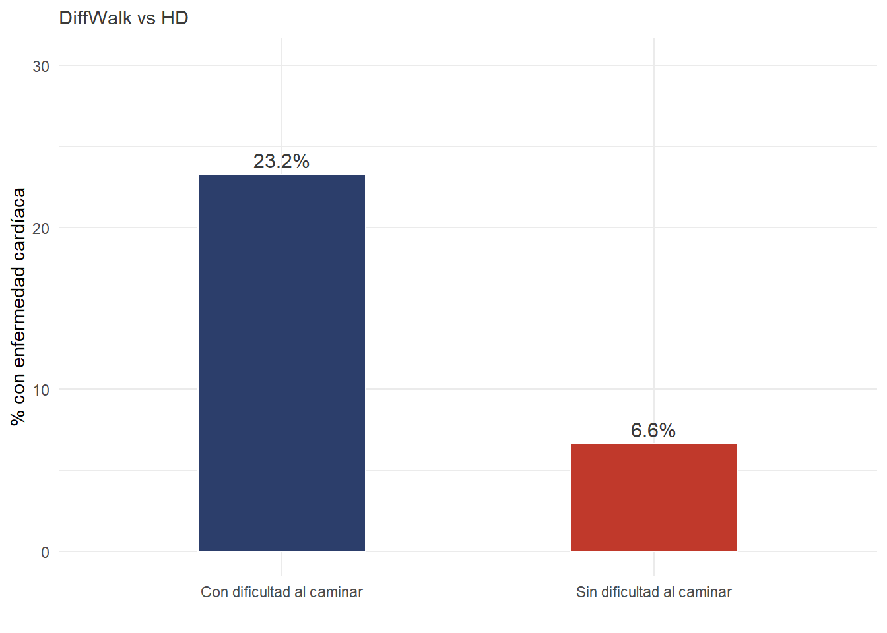

``` r
r$metricas %>% kable() %>% kable_styling(bootstrap_options="striped", full_width=FALSE)
```

<table class="table table-striped" style="color: black; width: auto !important; margin-left: auto; margin-right: auto;">
 <thead>
  <tr>
   <th style="text-align:left;"> Métrica </th>
   <th style="text-align:left;"> Valor </th>
  </tr>
 </thead>
<tbody>
  <tr>
   <td style="text-align:left;"> Chi² </td>
   <td style="text-align:left;"> 11475.8 </td>
  </tr>
  <tr>
   <td style="text-align:left;"> p-valor </td>
   <td style="text-align:left;"> 0e+00 </td>
  </tr>
  <tr>
   <td style="text-align:left;"> V de Cramér </td>
   <td style="text-align:left;"> 0.2127 </td>
  </tr>
  <tr>
   <td style="text-align:left;"> Tasa (Sin dificultad al caminar) </td>
   <td style="text-align:left;"> 6.62% </td>
  </tr>
  <tr>
   <td style="text-align:left;"> Tasa (Con dificultad al caminar) </td>
   <td style="text-align:left;"> 23.23% </td>
  </tr>
</tbody>
</table>

**DiffWalk tiene la mayor V de Cramér entre las variables binarias (0.2127)**. Quienes reportan dificultad tienen una tasa 3.5 veces mayor (23.23% vs 6.62%).

#### Sex


``` r
r <- biv_binaria("Sex", c("Mujer","Hombre"), "Sex")
print(r$plot)
```

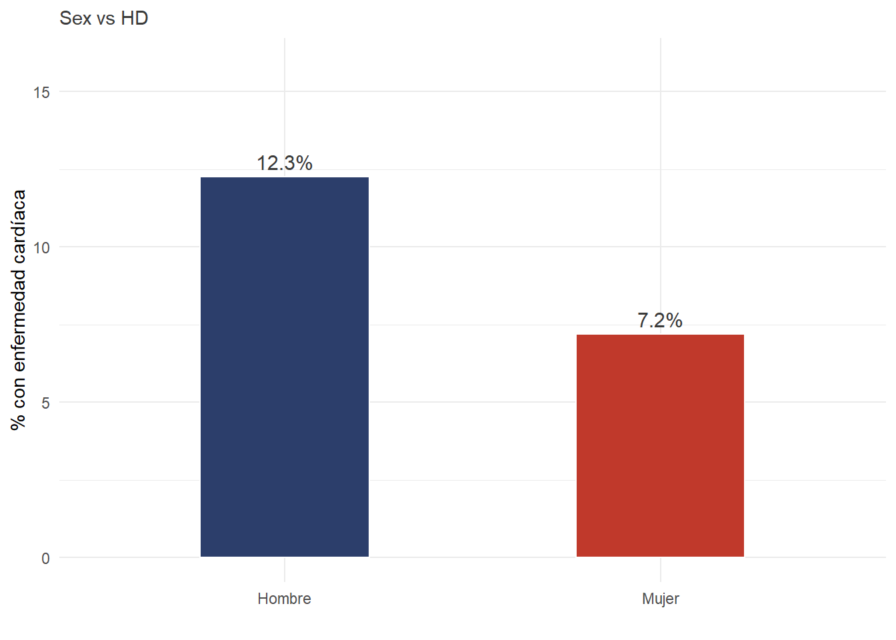

``` r
r$metricas %>% kable() %>% kable_styling(bootstrap_options="striped", full_width=FALSE)
```

<table class="table table-striped" style="color: black; width: auto !important; margin-left: auto; margin-right: auto;">
 <thead>
  <tr>
   <th style="text-align:left;"> Métrica </th>
   <th style="text-align:left;"> Valor </th>
  </tr>
 </thead>
<tbody>
  <tr>
   <td style="text-align:left;"> Chi² </td>
   <td style="text-align:left;"> 1879.8 </td>
  </tr>
  <tr>
   <td style="text-align:left;"> p-valor </td>
   <td style="text-align:left;"> 0e+00 </td>
  </tr>
  <tr>
   <td style="text-align:left;"> V de Cramér </td>
   <td style="text-align:left;"> 0.0861 </td>
  </tr>
  <tr>
   <td style="text-align:left;"> Tasa (Mujer) </td>
   <td style="text-align:left;"> 7.19% </td>
  </tr>
  <tr>
   <td style="text-align:left;"> Tasa (Hombre) </td>
   <td style="text-align:left;"> 12.25% </td>
  </tr>
</tbody>
</table>

Los hombres presentan casi el doble de tasa que las mujeres (12.25% vs 7.19%), con V=0.0861.

### Variables Ordinales


``` r
biv_ordinal <- function(var, etiquetas, titulo) {
  tasa <- df %>%
    group_by(.data[[var]]) %>%
    summarise(tasa = mean(HeartDiseaseorAttack)*100, .groups="drop") %>%
    mutate(Categoria = etiquetas)

  ct     <- table(df[[var]], df[[target_var]])
  chi2   <- chisq.test(ct)
  n      <- sum(ct)
  cramer <- sqrt(chi2$statistic / (n * (min(dim(ct)) - 1)))

  p <- ggplot(tasa, aes(x=seq_along(Categoria)-1, y=tasa,
                         fill=tasa)) +
    geom_col(color="white", width=0.6) +
    geom_text(aes(label=paste0(round(tasa,1),"%")), vjust=-0.5, size=3, color="#3a3a3a") +
    scale_fill_gradient(low=col_azul, high=col_rojo) +
    scale_x_continuous(breaks=seq_along(etiquetas)-1, labels=etiquetas) +
    scale_y_continuous(limits=c(0, max(tasa$tasa)*1.25)) +
    labs(title=paste(titulo,"vs HD"), x="", y="% con enfermedad cardíaca") +
    theme_minimal() +
    theme(legend.position="none", axis.text.x=element_text(angle=35, hjust=1, size=8),
          plot.title=element_text(color="#3a3a3a", size=11))

  metricas <- tibble(
    Métrica = c("Chi²","p-valor","V de Cramér","Tasa mínima","Tasa máxima"),
    Valor   = c(round(chi2$statistic,1), format(chi2$p.value,scientific=TRUE,digits=3),
                round(as.numeric(cramer),4),
                paste0(round(min(tasa$tasa),2),"%"),
                paste0(round(max(tasa$tasa),2),"%"))
  )
  list(plot=p, metricas=metricas)
}
```

#### GenHlth


``` r
r <- biv_ordinal("GenHlth", c("Excelente","Muy buena","Buena","Regular","Mala"), "GenHlth")
print(r$plot)
```

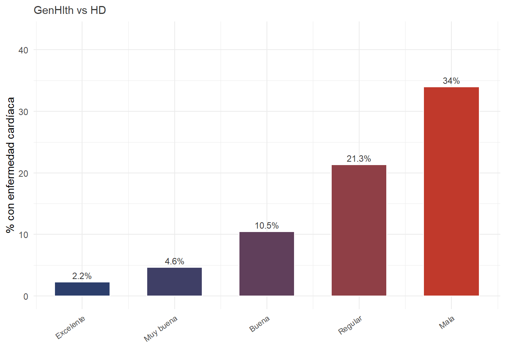

``` r
r$metricas %>% kable() %>% kable_styling(bootstrap_options="striped", full_width=FALSE)
```

<table class="table table-striped" style="color: black; width: auto !important; margin-left: auto; margin-right: auto;">
 <thead>
  <tr>
   <th style="text-align:left;"> Métrica </th>
   <th style="text-align:left;"> Valor </th>
  </tr>
 </thead>
<tbody>
  <tr>
   <td style="text-align:left;"> Chi² </td>
   <td style="text-align:left;"> 19008.2 </td>
  </tr>
  <tr>
   <td style="text-align:left;"> p-valor </td>
   <td style="text-align:left;"> 0e+00 </td>
  </tr>
  <tr>
   <td style="text-align:left;"> V de Cramér </td>
   <td style="text-align:left;"> 0.2737 </td>
  </tr>
  <tr>
   <td style="text-align:left;"> Tasa mínima </td>
   <td style="text-align:left;"> 2.24% </td>
  </tr>
  <tr>
   <td style="text-align:left;"> Tasa máxima </td>
   <td style="text-align:left;"> 34% </td>
  </tr>
</tbody>
</table>

**GenHlth es el predictor individual más fuerte del dataset (V=0.2737)**. La tasa sigue un gradiente perfectamente monótono desde 2.24% ("Excelente") hasta 34.0% ("Mala").

#### Age


``` r
r <- biv_ordinal("Age",
  c("18–24","25–29","30–34","35–39","40–44","45–49",
    "50–54","55–59","60–64","65–69","70–74","75–79","80+"), "Age")
print(r$plot)
```

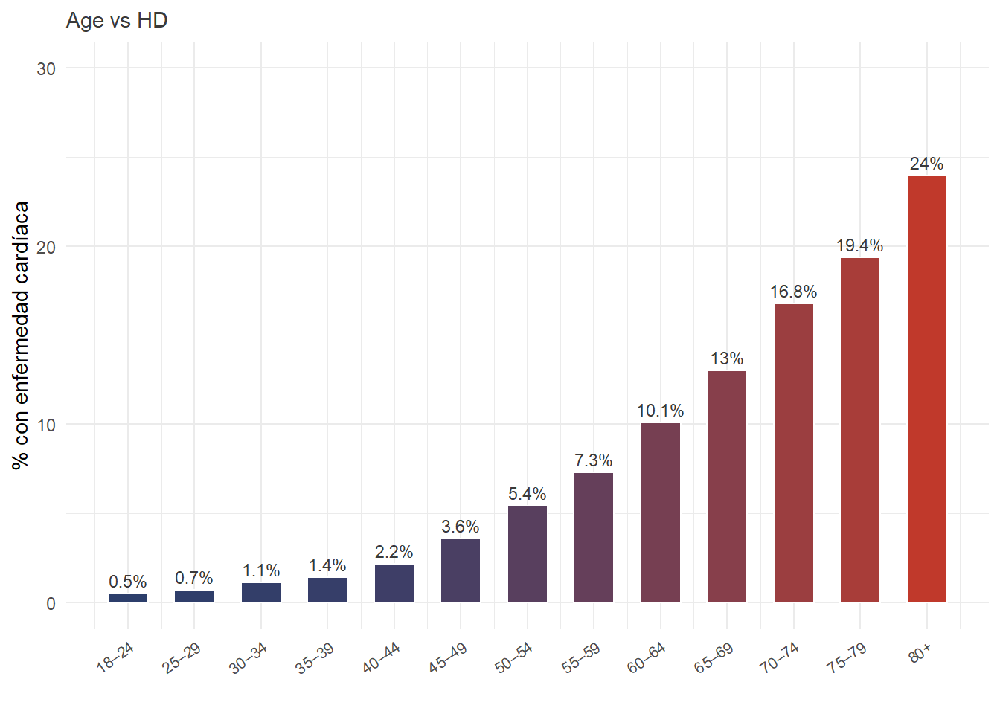

``` r
r$metricas %>% kable() %>% kable_styling(bootstrap_options="striped", full_width=FALSE)
```

<table class="table table-striped" style="color: black; width: auto !important; margin-left: auto; margin-right: auto;">
 <thead>
  <tr>
   <th style="text-align:left;"> Métrica </th>
   <th style="text-align:left;"> Valor </th>
  </tr>
 </thead>
<tbody>
  <tr>
   <td style="text-align:left;"> Chi² </td>
   <td style="text-align:left;"> 13731 </td>
  </tr>
  <tr>
   <td style="text-align:left;"> p-valor </td>
   <td style="text-align:left;"> 0e+00 </td>
  </tr>
  <tr>
   <td style="text-align:left;"> V de Cramér </td>
   <td style="text-align:left;"> 0.2327 </td>
  </tr>
  <tr>
   <td style="text-align:left;"> Tasa mínima </td>
   <td style="text-align:left;"> 0.51% </td>
  </tr>
  <tr>
   <td style="text-align:left;"> Tasa máxima </td>
   <td style="text-align:left;"> 23.95% </td>
  </tr>
</tbody>
</table>

Gradiente monótono desde 0.51% (18–24) hasta 23.95% (80+), con V=0.2327.

#### Education


``` r
r <- biv_ordinal("Education",
  c("Sin escuela","Primaria inc.","Secundaria inc.",
    "Secundaria","Univ. inc.","Univ. completa"), "Education")
print(r$plot)
```

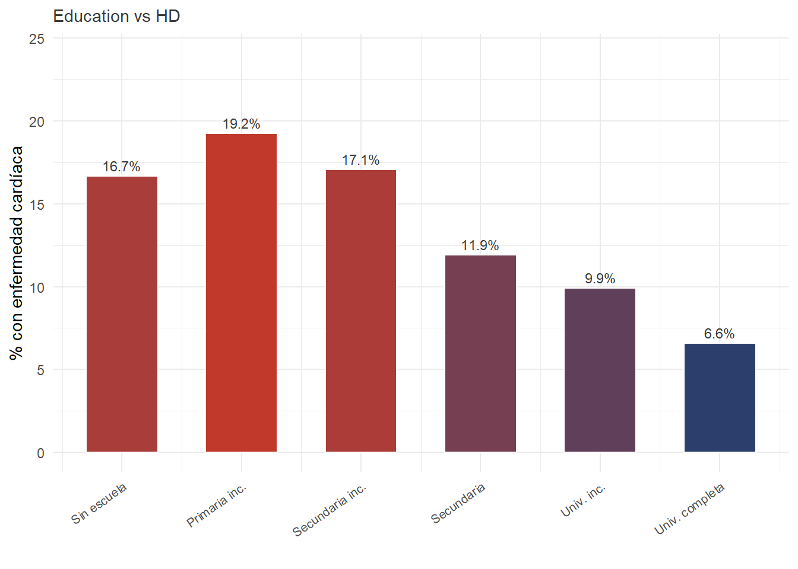

``` r
r$metricas %>% kable() %>% kable_styling(bootstrap_options="striped", full_width=FALSE)
```

<table class="table table-striped" style="color: black; width: auto !important; margin-left: auto; margin-right: auto;">
 <thead>
  <tr>
   <th style="text-align:left;"> Métrica </th>
   <th style="text-align:left;"> Valor </th>
  </tr>
 </thead>
<tbody>
  <tr>
   <td style="text-align:left;"> Chi² </td>
   <td style="text-align:left;"> 2589.8 </td>
  </tr>
  <tr>
   <td style="text-align:left;"> p-valor </td>
   <td style="text-align:left;"> 0e+00 </td>
  </tr>
  <tr>
   <td style="text-align:left;"> V de Cramér </td>
   <td style="text-align:left;"> 0.101 </td>
  </tr>
  <tr>
   <td style="text-align:left;"> Tasa mínima </td>
   <td style="text-align:left;"> 6.6% </td>
  </tr>
  <tr>
   <td style="text-align:left;"> Tasa máxima </td>
   <td style="text-align:left;"> 19.24% </td>
  </tr>
</tbody>
</table>

Gradiente **inverso** (V=0.1010): a mayor educación, menor tasa de HD (de 16.67% a 6.60%).

#### Income


``` r
r <- biv_ordinal("Income",
  c("<$10k","$10–15k","$15–20k","$20–25k",
    "$25–35k","$35–50k","$50–75k","$75k+"), "Income")
print(r$plot)
```

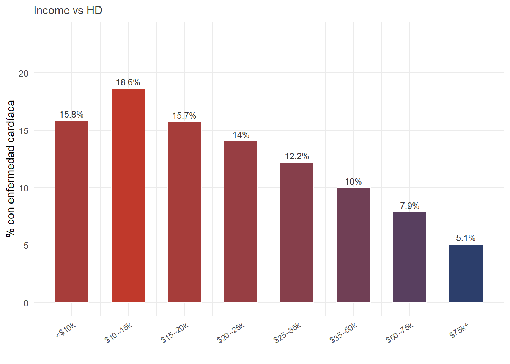

``` r
r$metricas %>% kable() %>% kable_styling(bootstrap_options="striped", full_width=FALSE)
```

<table class="table table-striped" style="color: black; width: auto !important; margin-left: auto; margin-right: auto;">
 <thead>
  <tr>
   <th style="text-align:left;"> Métrica </th>
   <th style="text-align:left;"> Valor </th>
  </tr>
 </thead>
<tbody>
  <tr>
   <td style="text-align:left;"> Chi² </td>
   <td style="text-align:left;"> 5277.6 </td>
  </tr>
  <tr>
   <td style="text-align:left;"> p-valor </td>
   <td style="text-align:left;"> 0e+00 </td>
  </tr>
  <tr>
   <td style="text-align:left;"> V de Cramér </td>
   <td style="text-align:left;"> 0.1442 </td>
  </tr>
  <tr>
   <td style="text-align:left;"> Tasa mínima </td>
   <td style="text-align:left;"> 5.07% </td>
  </tr>
  <tr>
   <td style="text-align:left;"> Tasa máxima </td>
   <td style="text-align:left;"> 18.65% </td>
  </tr>
</tbody>
</table>

El gradiente inverso más claro de las ordinales (V=0.1442): de 18.65% (<$15k) a 5.07% (>$75k).

#### Diabetes


``` r
r <- biv_ordinal("Diabetes", c("Sin diabetes","Prediabetes","Diabetes confirmada"), "Diabetes")
print(r$plot)
```

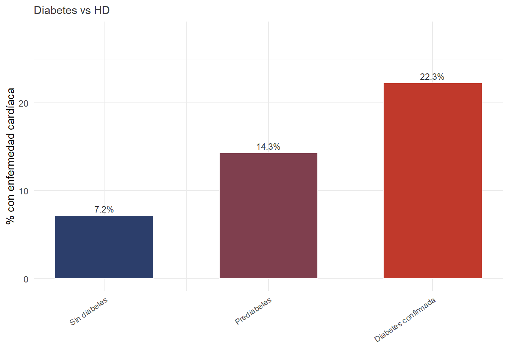

``` r
r$metricas %>% kable() %>% kable_styling(bootstrap_options="striped", full_width=FALSE)
```

<table class="table table-striped" style="color: black; width: auto !important; margin-left: auto; margin-right: auto;">
 <thead>
  <tr>
   <th style="text-align:left;"> Métrica </th>
   <th style="text-align:left;"> Valor </th>
  </tr>
 </thead>
<tbody>
  <tr>
   <td style="text-align:left;"> Chi² </td>
   <td style="text-align:left;"> 8244.9 </td>
  </tr>
  <tr>
   <td style="text-align:left;"> p-valor </td>
   <td style="text-align:left;"> 0e+00 </td>
  </tr>
  <tr>
   <td style="text-align:left;"> V de Cramér </td>
   <td style="text-align:left;"> 0.1803 </td>
  </tr>
  <tr>
   <td style="text-align:left;"> Tasa mínima </td>
   <td style="text-align:left;"> 7.18% </td>
  </tr>
  <tr>
   <td style="text-align:left;"> Tasa máxima </td>
   <td style="text-align:left;"> 22.29% </td>
  </tr>
</tbody>
</table>

Gradiente escalonado claro (V=0.1803): sin diabetes 7.18%, prediabetes 14.34%, diabetes confirmada 22.29% — **triplicando el riesgo basal**.

### Variables Continuas


``` r
biv_continua <- function(var, titulo) {
  g0 <- df %>% filter(HeartDiseaseorAttack==0) %>% pull(.data[[var]])
  g1 <- df %>% filter(HeartDiseaseorAttack==1) %>% pull(.data[[var]])

  mw  <- wilcox.test(g0, g1, alternative="two.sided")
  r   <- abs(cor(df[[var]], df[[target_var]], use="complete.obs"))

  datos_box <- df %>%
    mutate(Clase = ifelse(HeartDiseaseorAttack==0, "Sin HD","Con HD"))

  p <- ggplot(datos_box, aes(x=Clase, y=.data[[var]], fill=Clase)) +
    geom_boxplot(outlier.size=0.5, outlier.alpha=0.2, width=0.4,
                 color="#888", medianfill="white") +
    stat_summary(fun=mean, geom="point", shape=18, size=3, color="white") +
    scale_fill_manual(values=c("Sin HD"=col_azul,"Con HD"=col_rojo)) +
    labs(title=paste(titulo,"por clase (♦ = media)"), x="", y=var) +
    theme_minimal() + theme(legend.position="none",
                            plot.title=element_text(color="#3a3a3a", size=11))

  metricas <- tibble(
    Métrica = c("Media (sin HD)","Mediana (sin HD)","Media (con HD)","Mediana (con HD)",
                "Mann-Whitney W","p-valor","|r| Pearson"),
    Valor   = c(round(mean(g0),2), round(median(g0),1),
                round(mean(g1),2), round(median(g1),1),
                format(mw$statistic,big.mark="."), format(mw$p.value,scientific=TRUE,digits=3),
                round(r,4))
  )
  list(plot=p, metricas=metricas)
}
```

#### BMI


``` r
r <- biv_continua("BMI", "BMI")
print(r$plot)
```

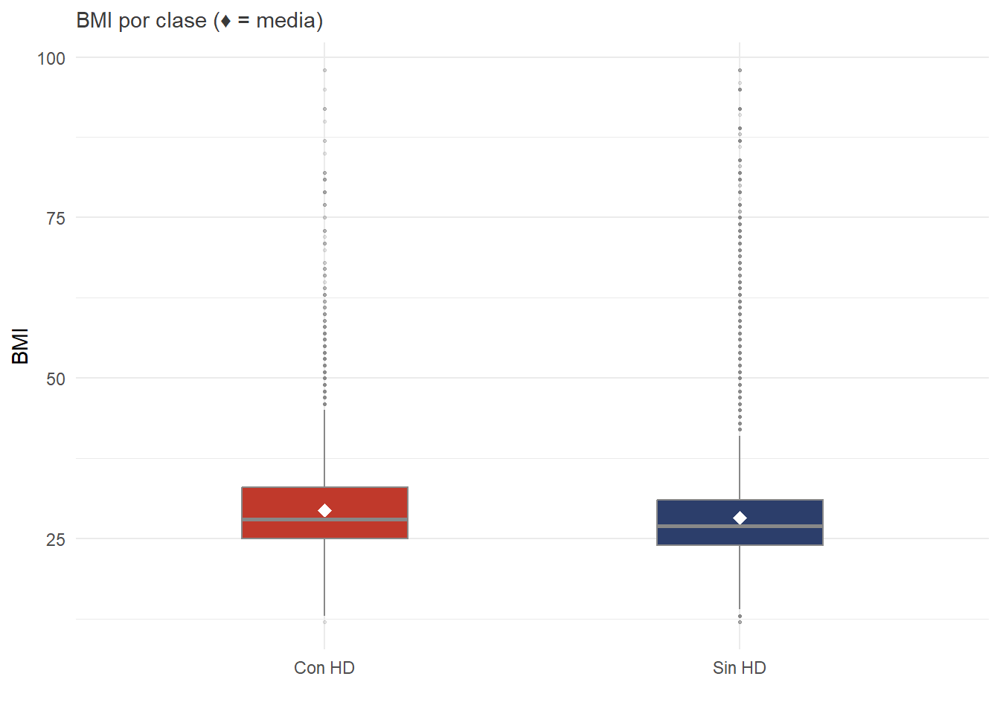

``` r
r$metricas %>% kable() %>% kable_styling(bootstrap_options="striped", full_width=FALSE)
```

<table class="table table-striped" style="color: black; width: auto !important; margin-left: auto; margin-right: auto;">
 <thead>
  <tr>
   <th style="text-align:left;"> Métrica </th>
   <th style="text-align:left;"> Valor </th>
  </tr>
 </thead>
<tbody>
  <tr>
   <td style="text-align:left;"> Media (sin HD) </td>
   <td style="text-align:left;"> 28.27 </td>
  </tr>
  <tr>
   <td style="text-align:left;"> Mediana (sin HD) </td>
   <td style="text-align:left;"> 27 </td>
  </tr>
  <tr>
   <td style="text-align:left;"> Media (con HD) </td>
   <td style="text-align:left;"> 29.47 </td>
  </tr>
  <tr>
   <td style="text-align:left;"> Mediana (con HD) </td>
   <td style="text-align:left;"> 28 </td>
  </tr>
  <tr>
   <td style="text-align:left;"> Mann-Whitney W </td>
   <td style="text-align:left;"> 2.400.351.903 </td>
  </tr>
  <tr>
   <td style="text-align:left;"> p-valor </td>
   <td style="text-align:left;"> 1.45e-225 </td>
  </tr>
  <tr>
   <td style="text-align:left;"> &amp;#124;r&amp;#124; Pearson </td>
   <td style="text-align:left;"> 0.0529 </td>
  </tr>
</tbody>
</table>

Diferencia modesta (29.47 vs 28.27). El |r|=0.0529 indica poder discriminatorio limitado como predictor aislado, aunque contribuye en modelos multivariados.

#### MentHlth


``` r
r <- biv_continua("MentHlth", "MentHlth")
print(r$plot)
```

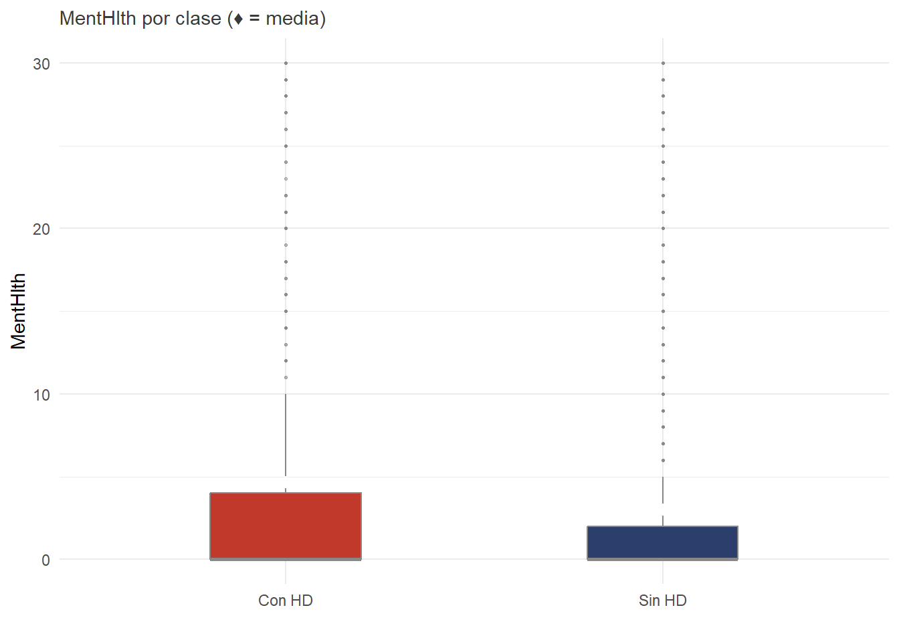

``` r
r$metricas %>% kable() %>% kable_styling(bootstrap_options="striped", full_width=FALSE)
```

<table class="table table-striped" style="color: black; width: auto !important; margin-left: auto; margin-right: auto;">
 <thead>
  <tr>
   <th style="text-align:left;"> Métrica </th>
   <th style="text-align:left;"> Valor </th>
  </tr>
 </thead>
<tbody>
  <tr>
   <td style="text-align:left;"> Media (sin HD) </td>
   <td style="text-align:left;"> 3.03 </td>
  </tr>
  <tr>
   <td style="text-align:left;"> Mediana (sin HD) </td>
   <td style="text-align:left;"> 0 </td>
  </tr>
  <tr>
   <td style="text-align:left;"> Media (con HD) </td>
   <td style="text-align:left;"> 4.67 </td>
  </tr>
  <tr>
   <td style="text-align:left;"> Mediana (con HD) </td>
   <td style="text-align:left;"> 0 </td>
  </tr>
  <tr>
   <td style="text-align:left;"> Mann-Whitney W </td>
   <td style="text-align:left;"> 2.591.040.387 </td>
  </tr>
  <tr>
   <td style="text-align:left;"> p-valor </td>
   <td style="text-align:left;"> 1.23e-68 </td>
  </tr>
  <tr>
   <td style="text-align:left;"> &amp;#124;r&amp;#124; Pearson </td>
   <td style="text-align:left;"> 0.0646 </td>
  </tr>
</tbody>
</table>

Diferencia de 1.6 días en promedio (4.67 vs 3.03), con |r|=0.0646. Ambos grupos tienen mediana 0, pero el grupo enfermo tiene colas más pesadas.

#### PhysHlth


``` r
r <- biv_continua("PhysHlth", "PhysHlth")
print(r$plot)
```

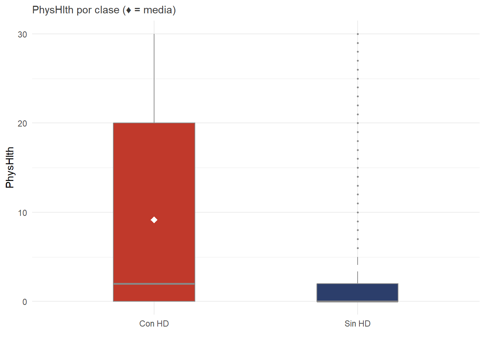

``` r
r$metricas %>% kable() %>% kable_styling(bootstrap_options="striped", full_width=FALSE)
```

<table class="table table-striped" style="color: black; width: auto !important; margin-left: auto; margin-right: auto;">
 <thead>
  <tr>
   <th style="text-align:left;"> Métrica </th>
   <th style="text-align:left;"> Valor </th>
  </tr>
 </thead>
<tbody>
  <tr>
   <td style="text-align:left;"> Media (sin HD) </td>
   <td style="text-align:left;"> 3.73 </td>
  </tr>
  <tr>
   <td style="text-align:left;"> Mediana (sin HD) </td>
   <td style="text-align:left;"> 0 </td>
  </tr>
  <tr>
   <td style="text-align:left;"> Media (con HD) </td>
   <td style="text-align:left;"> 9.15 </td>
  </tr>
  <tr>
   <td style="text-align:left;"> Mediana (con HD) </td>
   <td style="text-align:left;"> 2 </td>
  </tr>
  <tr>
   <td style="text-align:left;"> Mann-Whitney W </td>
   <td style="text-align:left;"> 2.010.084.636 </td>
  </tr>
  <tr>
   <td style="text-align:left;"> p-valor </td>
   <td style="text-align:left;"> 0e+00 </td>
  </tr>
  <tr>
   <td style="text-align:left;"> &amp;#124;r&amp;#124; Pearson </td>
   <td style="text-align:left;"> 0.1817 </td>
  </tr>
</tbody>
</table>

**La variable continua con mayor asociación (|r|=0.1817)**. Las personas con HD reportan en promedio 9.15 días de mala salud física vs 3.73 — una diferencia de 5.4 días.

### Interacciones entre factores de riesgo

Se exploran combinaciones de los factores con mayor V de Cramér para detectar efectos sinérgicos.


``` r
# HighBP × HighChol
heat1 <- df %>%
  group_by(HighBP, HighChol) %>%
  summarise(tasa=mean(HeartDiseaseorAttack)*100, .groups="drop") %>%
  mutate(HighBP=factor(HighBP,labels=c("Sin HTA","Con HTA")),
         HighChol=factor(HighChol,labels=c("Sin Col.","Con Col.")))

p1 <- ggplot(heat1, aes(x=HighChol, y=HighBP, fill=tasa)) +
  geom_tile() + geom_text(aes(label=paste0(round(tasa,1),"%")), size=4, color="white") +
  scale_fill_gradient(low=col_azul, high=col_rojo, name="% HD") +
  labs(title="HighBP × HighChol → % HD") + theme_minimal()

# Stroke × HighBP
heat2 <- df %>%
  group_by(Stroke, HighBP) %>%
  summarise(tasa=mean(HeartDiseaseorAttack)*100, .groups="drop") %>%
  mutate(Stroke=factor(Stroke,labels=c("Sin ACV","Con ACV")),
         HighBP=factor(HighBP,labels=c("Sin HTA","Con HTA")))

p2 <- ggplot(heat2, aes(x=HighBP, y=Stroke, fill=tasa)) +
  geom_tile() + geom_text(aes(label=paste0(round(tasa,1),"%")), size=4, color="white") +
  scale_fill_gradient(low=col_azul, high=col_rojo, name="% HD") +
  labs(title="Stroke × HighBP → % HD") + theme_minimal()

# DiffWalk × GenHlth
heat3 <- df %>%
  group_by(DiffWalk, GenHlth) %>%
  summarise(tasa=mean(HeartDiseaseorAttack)*100, .groups="drop") %>%
  mutate(DiffWalk=factor(DiffWalk,labels=c("Sin dif.","Con dif.")))

p3 <- ggplot(heat3, aes(x=factor(GenHlth), y=DiffWalk, fill=tasa)) +
  geom_tile() + geom_text(aes(label=paste0(round(tasa,1),"%")), size=3.5, color="white") +
  scale_fill_gradient(low=col_azul, high=col_rojo, name="% HD") +
  scale_x_discrete(labels=c("Excelente","Muy b.","Buena","Regular","Mala")) +
  labs(title="DiffWalk × GenHlth → % HD", x="GenHlth", y="") + theme_minimal()

p1 + p2 + p3
```

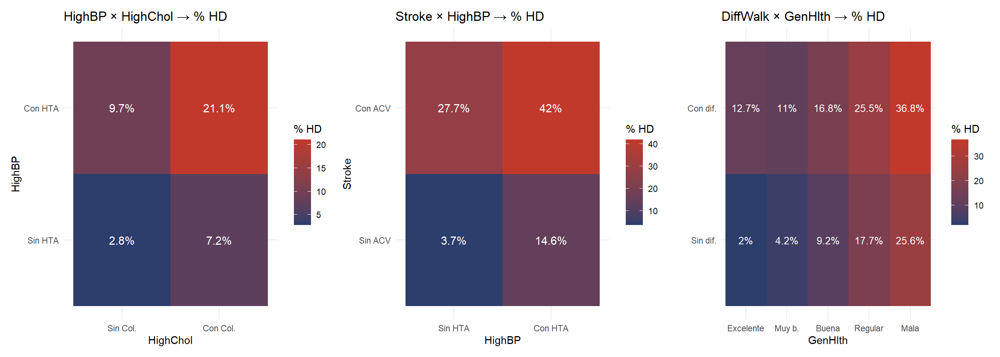

- **HighBP × HighChol**: la concurrencia eleva la tasa al 21.1% frente al 2.8% sin ninguno — diferencia de 7.5 veces.
- **Stroke × HighBP**: tasa combinada del 42.0%, la más alta detectada en el análisis.
- **DiffWalk × GenHlth**: personas con dificultad para caminar y salud percibida "Mala" alcanzan el 36.8%.

### Ranking de importancia de variables


``` r
scores <- bind_rows(
  map_dfr(c(binary_vars, ordinal_vars), function(v) {
    ct     <- table(df[[v]], df[[target_var]])
    chi2   <- chisq.test(ct)
    n      <- sum(ct)
    cramer <- sqrt(chi2$statistic / (n * (min(dim(ct)) - 1)))
    tibble(Variable=v, Metrica="V de Cramér", Score=round(as.numeric(cramer),4))
  }),
  map_dfr(continuous_vars, function(v) {
    r <- abs(cor(df[[v]], df[[target_var]], use="complete.obs"))
    tibble(Variable=v, Metrica="|Pearson r|", Score=round(r,4))
  })
) %>% arrange(desc(Score))

scores %>%
  ggplot(aes(x=Score, y=reorder(Variable, Score),
             fill=case_when(Score>0.15~"alta", Score>0.08~"moderada", TRUE~"baja"))) +
  geom_col(color="white", width=0.65) +
  geom_text(aes(label=round(Score,4)), hjust=-0.1, size=3, color="#3a3a3a") +
  geom_vline(xintercept=0.15, linetype="dashed", color=col_rojo, alpha=0.7) +
  geom_vline(xintercept=0.08, linetype="dashed", color="#E67E22", alpha=0.7) +
  scale_fill_manual(values=c("alta"=col_rojo,"moderada"="#E67E22","baja"=col_azul),
                    name="Asociación") +
  scale_x_continuous(limits=c(0, max(scores$Score)*1.15)) +
  labs(title="Ranking de asociación con HeartDiseaseorAttack\n(V de Cramér para categóricas; |r| Pearson para continuas)",
       x="Score de asociación", y="") +
  theme_minimal() + theme(plot.title=element_text(color="#3a3a3a", size=11))
```

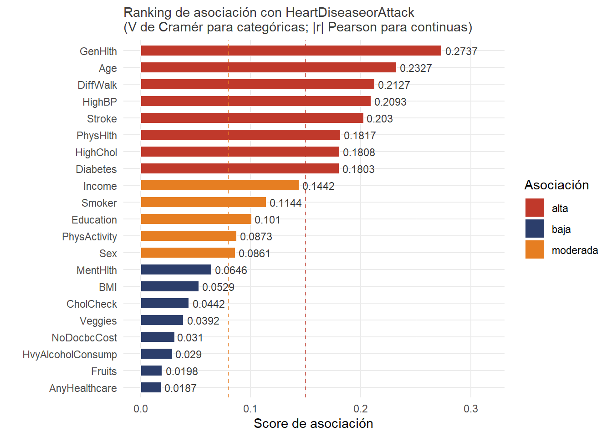

El ranking confirma que las 6 variables con mayor poder discriminatorio son todas categóricas u ordinales:

| Posición | Variable | Score | Naturaleza |
|----------|----------|-------|------------|
| 1 | GenHlth | 0.2737 | Ordinal (autopercepción salud) |
| 2 | Age | 0.2327 | Ordinal (edad) |
| 3 | DiffWalk | 0.2127 | Binaria (limitación funcional) |
| 4 | HighBP | 0.2093 | Binaria (hipertensión) |
| 5 | Stroke | 0.2030 | Binaria (ACV previo) |
| 6 | HighChol | 0.1808 | Binaria (colesterol alto) |

---

## Síntesis y Hallazgos Principales

### Factores con mayor asociación

**Factores clínicos y funcionales (alta magnitud):**

- La **autopercepción de salud general** (GenHlth, V=0.274) es el predictor más fuerte: tasa desde 2.2% ("Excelente") hasta 34.0% ("Mala").
- La **edad** (V=0.233) confirma el efecto acumulativo del envejecimiento (0.5% a 24.0%).
- La **dificultad para caminar** (DiffWalk, V=0.213): 3.5 veces más riesgo.
- La **hipertensión arterial** (HighBP, V=0.209) cuadruplica el riesgo.
- El **antecedente de ACV** (Stroke, V=0.203): tasa absoluta más alta entre variables binarias (38.3%).
- La **diabetes** (V=0.180): gradiente triplicado entre sin diabetes y diabetes confirmada.

**Factores conductuales (magnitud moderada):**

- **Tabaquismo** (V=0.114): duplica el riesgo.
- **Inactividad física** (V=0.087): tasa 1.75 veces mayor.
- **Sexo** (V=0.086): hombres 12.3% vs mujeres 7.2%.

**Determinantes socioeconómicos (gradientes inversos):** A mayor ingreso y nivel educativo, menor tasa de HD.

### Interacciones sinérgicas

- HTA + Colesterol alto → 21.1% (vs 2.8% sin ninguno)
- ACV + HTA → 42.0%
- DiffWalk + salud percibida "Mala" → 36.8%

### Implicaciones para la futura modelación

1. **Desbalance de clases** (90.6% vs 9.4%): requiere SMOTE, class_weight o umbralización personalizada.
2. **Variables prioritarias**: GenHlth, Age, DiffWalk, HighBP, Stroke y HighChol como features obligatorias.
3. **Distribuciones asimétricas**: MentHlth, PhysHlth y BMI requieren transformación o modelos robustos.
4. **Variables de baja utilidad individual**: Fruits, AnyHealthcare y HvyAlcoholConsump (V < 0.03) candidatas a reducción dimensional.

---

## Referencias bibliográficas

American Heart Association. (2024). *Increasing number of Americans under 55 dying of severe heart attacks*. Journal of the American Heart Association. https://www.ahajournals.org

Centers for Disease Control and Prevention. (2015). *Behavioral Risk Factor Surveillance System (BRFSS) 2015 survey data*. U.S. Department of Health and Human Services. https://www.cdc.gov/brfss

Teboul, A. (2021). *Heart disease health indicators dataset* [Dataset]. Kaggle. https://www.kaggle.com/datasets/alexteboul/heart-disease-health-indicators-dataset

Texas Heart Institute. (s.f.). *Ataque cardíaco*. https://www.texasheart.org

National Heart, Lung, and Blood Institute. (s.f.). *Heart disease risk factors*. https://www.nhlbi.nih.gov

Centers for Disease Control and Prevention. (2024). *About BRFSS*. https://www.cdc.gov/brfss/about/index.htm

IBM. (s.f.). *Exploratory data analysis*. https://www.ibm.com/mx-es/think/topics/exploratory-data-analysis

MSD Manuals. (s.f.). *Insuficiencia cardíaca*. https://www.msdmanuals.com/es/hogar/trastornos-del-corazón
